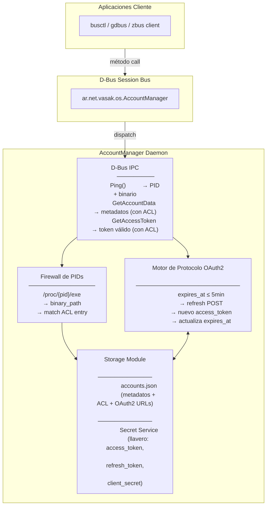
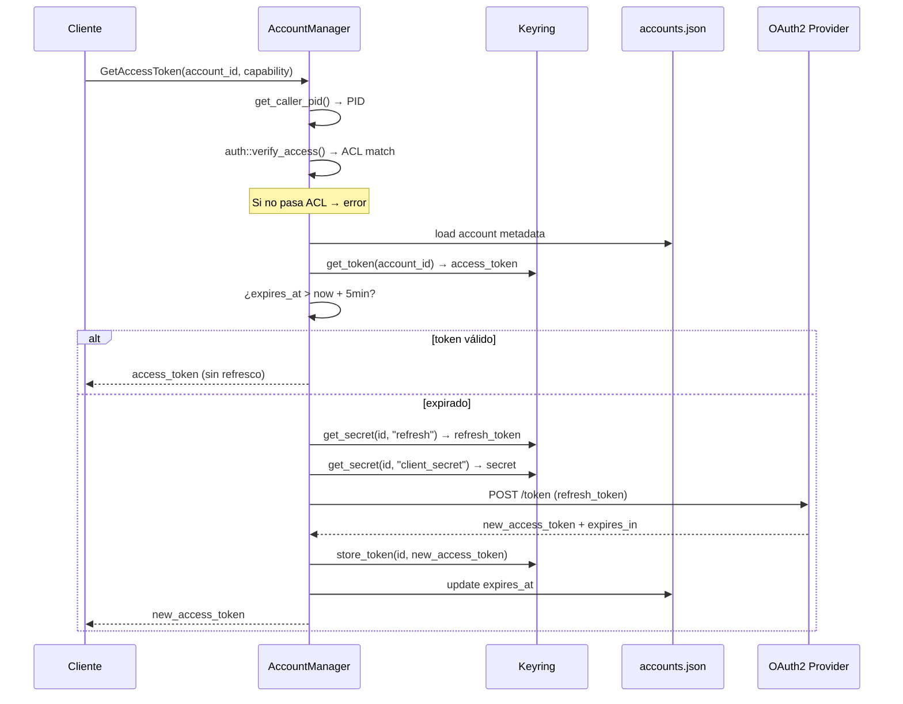

# VasakOS Account Manager

Demonio centralizado para la gestión de cuentas de usuario en VasakOS.
Expone un servicio D-Bus (`ar.net.vasak.os.AccountManager`) que abstrae
almacenamiento, autenticación OAuth2 y control de acceso para múltiples
aplicaciones (email, calendarios, contactos, chats, etc.).

---

## Arquitectura



---

## Dependencias (Cargo.toml)

| Crate | Versión | Propósito |
|-------|---------|-----------|
| `zbus` | 4 (tokio) | Comunicación D-Bus |
| `tokio` | 1 (full) | Runtime asíncrono |
| `tracing` / `tracing-subscriber` | 0.1 / 0.3 | Logging estructurado |
| `serde` / `serde_json` | 1 / 1 | Serialización JSON |
| `keyring` | 4 | Llavero del sistema (Secret Service) |
| `uuid` | 1 (v4) | Generación de UUID |
| `dirs` | 5 | Resolución de directorios del usuario |
| `oauth2` | 5 (reqwest) | Flujo de refresco OAuth2 |
| `reqwest` | 0.12 (rustls-tls) | HTTP asíncrono |
| `chrono` | 0.4 (serde) | Manejo de fechas/horas |

---

## Requisitos del sistema

- **Rust**: 1.75+ (edición 2021)
- **D-Bus**: Sesión de usuario activa (`dbus-daemon --session`)
- **Secret Service**: GNOME Keyring, KDE Wallet o `keepassxc` corriendo
- **systemd** (opcional): para `busctl`

---

## Uso

### Levantar el demonio

```bash
RUST_LOG=info cargo run
```

Variables de entorno disponibles:

| Variable | Valores | Efecto |
|----------|---------|--------|
| `RUST_LOG` | `info`, `debug`, `trace` | Nivel de verbose |

En el primer arranque el servicio crea una cuenta demo con metadatos
OAuth2, ACL y tokens de prueba en el llavero.

### Probar desde otra terminal

```bash
# Ping — identificación del cliente
busctl --user call                                     \
    ar.net.vasak.os.AccountManager                    \
    /ar/net/vasak/os/AccountManager                   \
    ar.net.vasak.os.AccountManager                    \
    Ping

# GetAccountData — metadatos (con ACL)
busctl --user call                                     \
    ar.net.vasak.os.AccountManager                    \
    /ar/net/vasak/os/AccountManager                   \
    ar.net.vasak.os.AccountManager                    \
    GetAccountData ss "<account_id>" "email"

# GetAccessToken — token válido (con ACL + refresco automático)
busctl --user call                                     \
    ar.net.vasak.os.AccountManager                    \
    /ar/net/vasak/os/AccountManager                   \
    ar.net.vasak.os.AccountManager                    \
    GetAccessToken ss "<account_id>" "email"
```

**Importante**: usar `--user` (busctl) para conectarse al bus de sesión.

---

## API D-Bus

### Interfaz

```
ar.net.vasak.os.AccountManager
```

### Objeto

```
/ar/net/vasak/os/AccountManager
```

### Métodos

| Método | Entrada | Salida | Descripción |
|--------|---------|--------|-------------|
| `Ping` | — | `String` | Identifica al cliente (PID + binario) |
| `GetAccountData` | `account_id: s, capability: s` | `String` (JSON) | Metadatos de la capability (con ACL) |
| `GetAccessToken` | `account_id: s, capability: s` | `String` | Access_token válido (ACL + refresco automático) |

### Flujo interno de `GetAccessToken`



---

## Módulo `storage`

### Modelo de datos

```rust
pub enum CapabilityType {
    Email, Calendar, Contacts, Chat, Drive, Tasks,
}

pub struct AccessControlEntry {
    pub binary_path: String,
    pub allowed_capabilities: Vec<CapabilityType>,
}

pub struct Account {
    pub id: String,
    pub display_name: String,
    pub provider_type: String,
    pub capabilities: HashMap<CapabilityType, Value>,
    pub acl: Vec<AccessControlEntry>,
}
```

### SecureKeyringManager

| Método | Clave en llavero | Propósito |
|--------|-------------------|-----------|
| `store_token(id, t)` / `get_token(id)` | `{service}/{id}` | access_token |
| `store_secret(id, "refresh", s)` / `get_secret(id, "refresh")` | `{service}/{id}:refresh` | refresh_token |
| `store_secret(id, "client_secret", s)` / `get_secret(id, "client_secret")` | `{service}/{id}:client_secret` | client_secret |

Servicio: `vasakos-account-manager`.

## Módulo `auth`

```rust
pub fn verify_access(
    account: &Account,
    client_pid: u32,
    requested_capability: &CapabilityType,
) -> Result<bool, String>
```

Resuelve `/proc/{pid}/exe`, canonaliza, y compara contra la ACL de la
cuenta. Si el binario del proceso llamante no está en la lista blanca,
el acceso es denegado.

## Módulo `protocols::oauth2`

```rust
pub async fn get_valid_access_token(
    account_id: &str,
    capability: &CapabilityType,
) -> Result<String, String>
```

Verifica expiración, refresca automáticamente vía OAuth2 si es necesario,
persiste el nuevo token y su fecha de expiración. Sin comentarios.

---

## Estructura del proyecto

```
vasak-accounts/
├── Cargo.toml
├── .gitignore
├── README.md
├── test_ping.sh
└── src/
    ├── main.rs              # Servicio D-Bus + demo de storage
    ├── storage.rs           # Modelo de datos + JSON + llavero
    ├── auth.rs              # Firewall de PIDs (ACL)
    └── protocols/
        ├── mod.rs
        └── oauth2.rs        # Motor de refresco OAuth2
```

---

## Tests

```bash
cargo test
```

Actualmente 9 tests:

| Test | Módulo | Descripción |
|------|--------|-------------|
| `test_account_serde_roundtrip` | storage | Serialización/deserialización |
| `test_acl_serde_roundtrip` | storage | ACL viaja correctamente en JSON |
| `test_add_acl_entry_helper` | storage | `add_acl_entry()` funciona |
| `test_update_account` | storage | `update_account()` reemplaza campos |
| `test_capability_type_snake_case` | storage | `email`, `calendar`, etc. |
| `test_database_load_save_roundtrip` | storage | Persistencia JSON |
| `test_resolve_own_pid` | auth | `/proc/self/exe` se resuelve |
| `test_resolve_nonexistent_pid` | auth | PID inexistente → error |
| `test_matches_path_false` | auth | Paths distintos no matchean |

---

## Etapas del proyecto

| Etapa | Estado | Descripción |
|-------|--------|-------------|
| 1 | ✓ | Esqueleto D-Bus con `Ping` e identificación de cliente |
| 2 | ✓ | Almacenamiento polimórfico: JSON + llavero Secret Service |
| 3 | ✓ | Firewall de PIDs: ACL por binario en `auth.rs` |
| 4 | ✓ | Motor de Protocolo OAuth2: refresco automático de tokens |
| 5 | — | Notificaciones vía señales D-Bus |
