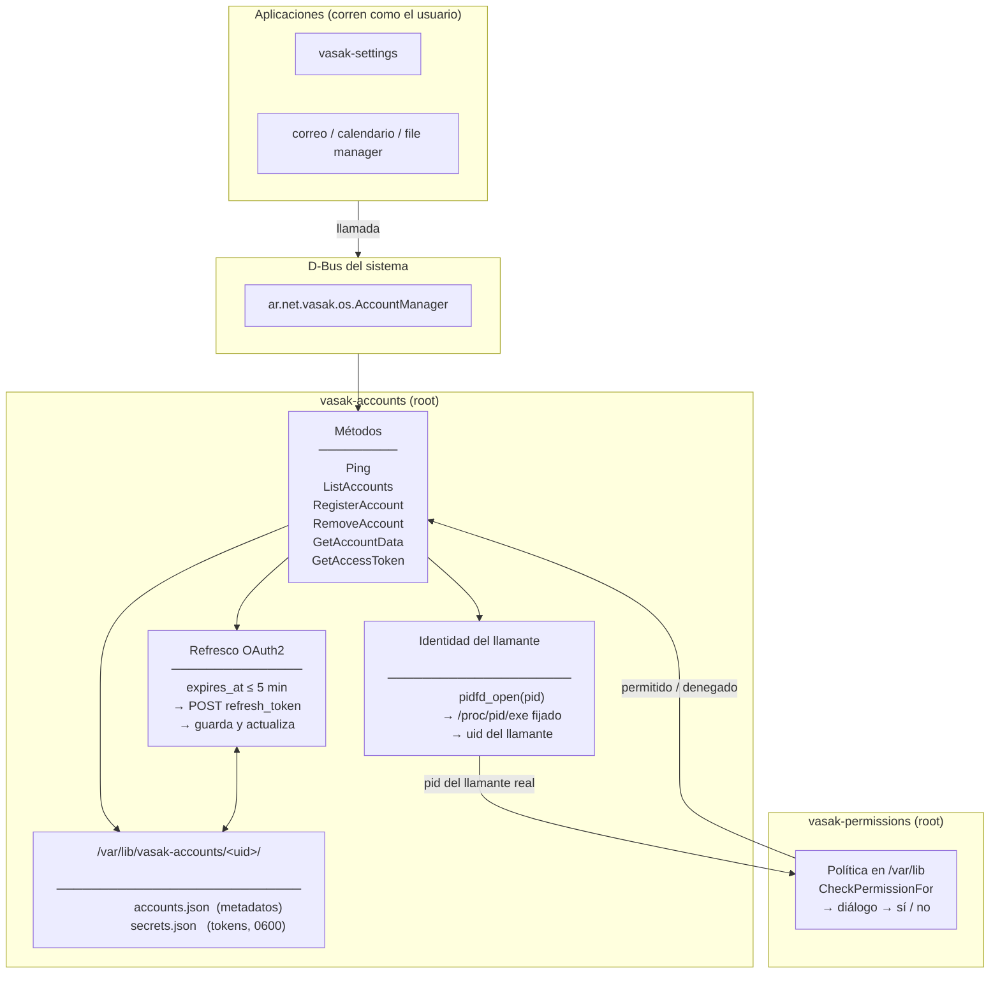
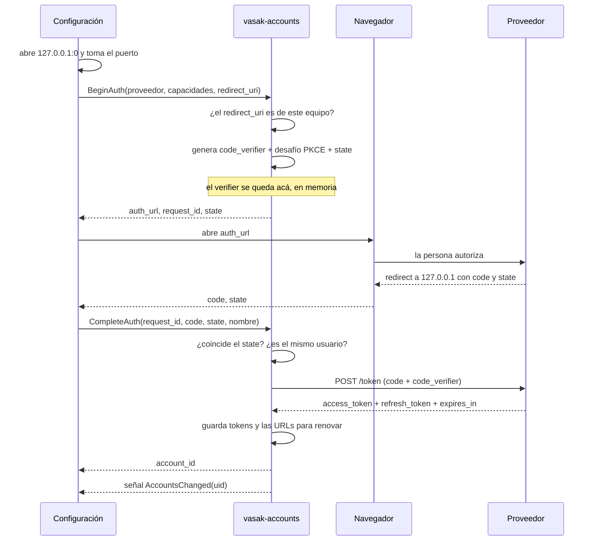
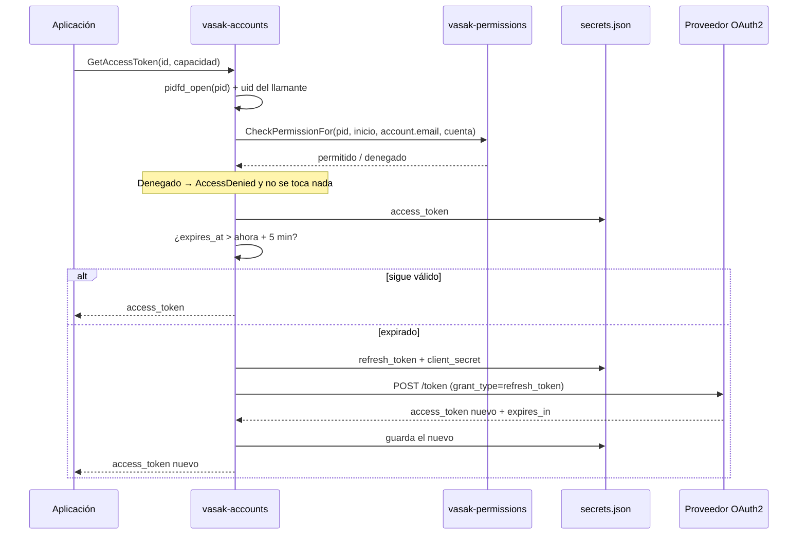
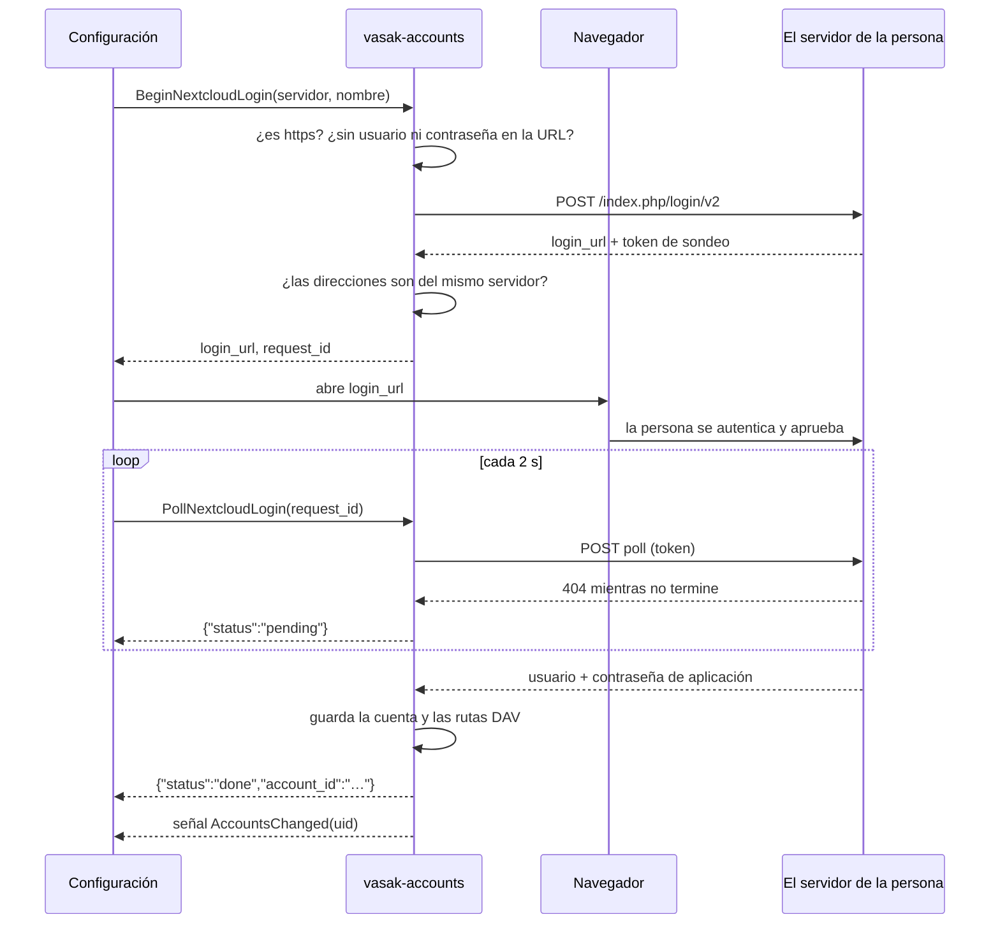

# VasakOS Account Manager

Centro de cuentas de VasakOS. Un servicio **del sistema** que guarda las cuentas
en línea de cada persona, obtiene y refresca sus tokens, y decide —preguntando a
`vasak-permissions`— qué aplicación puede usar cuál.

La idea que lo justifica: **una aplicación no puede leer tus tokens, tiene que
pedirlos — y entonces se te pregunta.** Los archivos son de root, así que ni la
app de correo ni nada que corra con tu cuenta los abre por su cuenta. Si la
autorizás, `GetAccessToken` le entrega el token de la capacidad que pidió y de
ninguna otra; si no, no le entrega nada. El permiso es lo que separa pedirlo de
tenerlo.

---

## Cómo encaja con el resto

El centro de cuentas es el dueño de las cuentas y de los tokens. Lo que se hace
con ellos vive en otras aplicaciones:

| Pieza | Qué hace |
|---|---|
| **`vasak-accounts`** (root) + su pantalla en `vasak-settings` | Alta y baja de cuentas, secretos, OAuth, y **qué apps tienen acceso** |
| **`vasak-accounts-sync`** (el usuario) | Mantiene al día el correo. Ver abajo. |
| **App de calendario** | Ver y crear eventos de las distintas cuentas |
| **App de correo** | Ver el correo y redactar/enviar |
| **File manager** | Discos en la nube |
| **App de chats** | Más adelante |

El plan por escrito, con las fases y lo que cuesta cada proveedor, está en
`issues/cuentas-en-linea-roadmap.md`, en el workspace de VasakOS — que no es un
repositorio, así que no hay enlace que poner.

---

## Arquitectura



### Por qué corre como root en el bus del sistema

Porque los tokens están en archivos de root, y eso es a propósito. Antes vivían
en el llavero del usuario, lo que dejaba el control de acceso en la nada:
cualquier programa corriendo con esa cuenta podía pedirle el token al llavero
directamente y saltarse la pregunta. Con los archivos del lado de root, este
servicio es la única puerta.

Y por lo mismo no puede ser un servicio de sesión: uno de sesión lo podría
reemplazar cualquier cosa que llegue primero al nombre del bus, y recibiría las
peticiones —y los tokens— en su lugar.

### Quién decide los permisos

No este servicio. Las reglas están en `vasak-permissions`, que guarda su política
fuera del alcance del usuario y exige polkit para cambiarla. Acá se pregunta con
`CheckPermissionFor`, pasando el **PID del programa que llamó**, no el propio: si
no fuera así, una sola decisión quedaría grabada contra
`/usr/bin/vasak-accounts` y la compartirían todas las aplicaciones.

Los identificadores de recurso son `account.email`, `account.calendar`,
`account.contacts`, `account.chat`, `account.drive` y `account.tasks`. El permiso
es **por aplicación y recurso, no por cuenta**: permitirle el correo a la app de
correo le permite todas tus casillas.

---

## API D-Bus

**Servicio:** `ar.net.vasak.os.AccountManager` (bus del **sistema**)
**Objeto:** `/ar/net/vasak/os/AccountManager`
**Interfaz:** `ar.net.vasak.os.AccountManager`

| Método | Entrada | Salida | Permiso | Descripción |
|---|---|---|---|---|
| `Ping` | — | `s` | — | Identifica al llamante (PID + binario). Diagnóstico. |
| `ListAccounts` | — | `s` (JSON) | — | Resumen de las cuentas del usuario que llama. Nunca un token. |
| `ListProviders` | — | `s` (JSON) | — | Qué proveedores hay, cuáles están configurados y qué capacidades todavía no pueden dar. |
| `BeginAuth` | `s` proveedor, `s` capacidades JSON, `s` redirect_uri | `s` (JSON) | — | Empieza a conectar una cuenta OAuth2. Devuelve `auth_url`, `request_id` y `state`. Descarta las capacidades que el proveedor todavía no puede dar; si no queda ninguna, `InvalidArgs`. |
| `CompleteAuth` | `s` request_id, `s` code, `s` state, `s` nombre | `s` id | — | Canjea el código y crea la cuenta. |
| `CancelAuth` | `s` request_id | `b` | — | Descarta un flujo abandonado. |
| `SetProviderCredentials` | `s` proveedor, `s` client_id, `s` client_secret | — | — | Guarda **tus** credenciales para un proveedor OAuth2. |
| `ClearProviderCredentials` | `s` proveedor | — | — | Las quita. Las cuentas ya conectadas siguen andando. |
| `BeginNextcloudLogin` | `s` servidor, `s` nombre | `s` (JSON) | — | Abre un inicio de sesión en un Nextcloud. Devuelve `login_url` y `request_id`. |
| `PollNextcloudLogin` | `s` request_id | `s` (JSON) | — | Un sondeo: `pending`, o `done` con el `account_id`. |
| `RegisterAccount` | `s` nombre, `s` proveedor, `s` capacidades JSON, `s` secretos JSON | `s` id | — | Cuenta con credenciales de **contraseña** (IMAP y compañía). No acepta secretos de OAuth2. |
| `RemoveAccount` | `s` id | `s` (JSON) | 🔑 polkit | Borra la cuenta, sus secretos, **y le avisa al proveedor**. Devuelve `{removed, revoked, detail}`. |
| `GetAccountData` | `s` id, `s` capacidad | `s` (JSON) | ✅ | Configuración de esa capacidad. |
| `GetAccessToken` | `s` id, `s` capacidad | `s` | ✅ | Un access_token **válido**, refrescándolo si hace falta. |

### Señal

| Señal | Cuerpo | Cuándo |
|---|---|---|
| `AccountsChanged` | `u` uid | Cambió algo de ese usuario: una cuenta, o las credenciales de un proveedor |

Una sola señal y sin detalle, a propósito. Este servicio atiende a todo el
equipo desde el bus del sistema, así que la señal la reciben todas las sesiones:
con el identificador de la cuenta adentro, quien escuche se enteraría de que a
la persona de al lado le cambió tal cuenta. Un `uid` no dice nada que no se vea
con `who`.

Y funciona mejor: quien la recibe vuelve a leer y ve el estado completo. Con
señales que llevan el cambio adentro, una que se pierde deja al cliente creyendo
algo que no es.

**Hay que releer `ListAccounts` y `ListProviders`.** Las dos cosas cambian por
esta señal: agregar o quitar una cuenta mueve la primera, y poner o sacar
credenciales propias mueve el `configured` de la segunda. Releer sólo una deja
la pantalla mostrando un proveedor apagado que ya está listo, o al revés.

### Por qué `ListAccounts` no pide permiso

Porque preguntar por algo tan seguido es lo que enseña a apretar «permitir» sin
leer, y ahí se pierde el valor de preguntar cuando importa: abrir la pantalla de
cuentas, o que la app de calendario dibuje una lista, no puede costar un diálogo
por cuenta.

Lo que se paga es que la lista la ve cualquier programa del usuario. Por eso sale
un **resumen** —id, nombre, proveedor, qué capacidades tiene, cuáles de ésas
todavía no se pueden usar y si hay que reconectarla— y no la cuenta entera. La
configuración completa, con el servidor y el `client_id`, sigue detrás de
`GetAccountData`, que sí pregunta.

```json
[{"id": "…", "display_name": "Alguien", "provider_type": "google",
  "capabilities": ["calendar", "contacts", "drive"],
  "unavailable_capabilities": ["drive"],
  "needs_reauth": false}]
```

### Lo que todavía no está disponible

Un proveedor OAuth2 puede ofrecer una capacidad —el alcance existe y se
concede— y **no tener todavía dónde usarla**: Google Drive no habla WebDAV, que
es por donde monta el gestor de archivos, y Microsoft no expone CalDAV ni CardDAV
(ver `Vasak-OS/vasak-file-manager#95` y la decisión en `vasak-accounts#24`). La
regla es que lo no implementado se ve **«todavía no disponible»**, nunca roto.

La fuente de verdad es el archivo del proveedor: una capacidad sin `[endpoints]`
es una capacidad sin dirección. No hay lista aparte; el día que `google.toml`
reciba `[endpoints.drive]`, Drive se enciende solo. Y sale por tres lados:

- `ListProviders` trae `unavailable_capabilities`, subconjunto de
  `capabilities`, para que la pantalla de conexión muestre la casilla apagada
  y no la esconda.
- `ListAccounts` trae `unavailable_capabilities` en cada resumen: las que la
  cuenta **tiene** y su proveedor todavía no puede dar. Es lo que necesita una
  barra lateral que no llama a `GetAccountData` hasta montar. Si el proveedor
  ya no está en el catálogo, va vacía: no se inventa nada.
- `BeginAuth` **descarta** las capacidades pedidas que no tienen dirección —lo
  registra, y sigue con las demás—, así no se le pide al proveedor un alcance
  que no se va a poder usar y la cuenta queda sin la capacidad en vez de con una
  rota. Si no queda ninguna, devuelve `InvalidArgs`: «ninguna de las capacidades
  pedidas está disponible todavía en 'google': drive».

Los dos campos nuevos se suman a lo que ya había; un cliente que no los conoce
los ignora.

```json
[{"id": "google", "display_name": "Google", "kind": "oauth2",
  "capabilities": ["calendar", "contacts", "drive", "email"],
  "unavailable_capabilities": ["drive"],
  "configured": false}]
```

🔑 quiere decir que pasa por polkit: la persona se autentica en un diálogo sobre
el que el programa que llamó no tiene ningún control. Agregar una cuenta no lo
necesita —si te arrepentís, la borrás— pero borrarla no se deshace: se va la
credencial y se corta el acceso del otro lado. Sin esto, cualquier programa
corriendo con tu cuenta podía dejarte sin cuentas en silencio.

Se autentica como **la propia persona** y no como administrador: es su cuenta, no
una configuración del equipo. La respuesta se recuerda un rato, así que quitar
tres cuentas seguidas pregunta una vez.

Las capacidades se nombran en minúscula: `email`, `calendar`, `contacts`,
`chat`, `drive`, `tasks`. Cualquier otra cosa devuelve `InvalidArgs` con la
lista de las válidas.

### Probar a mano

```bash
busctl call ar.net.vasak.os.AccountManager \
    /ar/net/vasak/os/AccountManager \
    ar.net.vasak.os.AccountManager Ping
```

```bash
busctl call ar.net.vasak.os.AccountManager \
    /ar/net/vasak/os/AccountManager \
    ar.net.vasak.os.AccountManager ListAccounts
```

```bash
busctl call ar.net.vasak.os.AccountManager \
    /ar/net/vasak/os/AccountManager \
    ar.net.vasak.os.AccountManager GetAccessToken ss "<id>" "email"
```

Sin `--user`: es el bus del sistema.

### Flujo de conexión de una cuenta



Lo que hace que esto valga la pena: el `code_verifier` se genera en el servicio
y no sale de ahí. Un código de autorización sin su verifier no sirve para nada,
así que lo que la ventana de configuración maneja **no es un secreto**. Antes el
canje ocurría en el webview, y el `refresh_token` terminaba pasando por un
proceso del usuario — justo lo que se había evitado al mover los tokens a
archivos de root.

### Flujo de `GetAccessToken`



---

## Borrar una cuenta le avisa al proveedor

Sin ese aviso, borrar una cuenta borraba lo de acá y del otro lado quedaba todo
vivo: la autorización seguía figurando entre las aplicaciones con acceso y el
token servía hasta caducar. Quien borra una cuenta espera que se corte el acceso,
no que se esconda.

Cada proveedor lo hace distinto:

| | Cómo |
|---|---|
| OAuth2 con `revocation_url` | `POST` al endpoint de RFC 7009 con el **refresh_token** |
| Nextcloud | `DELETE` a `ocs/v2.php/core/apppassword`, autenticado con la propia contraseña de aplicación |
| IMAP con contraseña | Nada que revocar: la contraseña es de la persona |

Se manda el refresh_token y no el de acceso: revocar el refresh invalida la
concesión entera, mientras que revocar uno de acceso deja al otro vivo y la
aplicación seguiría figurando entre las que tienen permiso.

**Si el aviso falla, la cuenta se borra igual.** Negarse dejaría a alguien sin
poder sacar una cuenta porque no tiene red, o porque el servidor de su casa está
apagado, y eso es peor que el problema. Lo que sí se hace es decirlo —`revoked`
viene en `false` con el motivo— porque queda algo que se puede terminar desde la
web del proveedor. Microsoft es el caso permanente de eso: no expone endpoint de
revocación, así que el acceso se quita desde la página de la cuenta.

La dirección para avisar se guarda **con la cuenta** y no se busca en el catálogo
al borrarla: si mañana cambia el archivo de `/etc`, hay que avisarle al servidor
al que esa cuenta autorizó y no al que diga el archivo nuevo.

## Almacenamiento

Todo bajo `/var/lib/vasak-accounts/<uid>/`, un directorio por persona en modo
`0700`:

| Archivo | Modo | Contenido |
|---|---|---|
| `accounts.json` | 0600 | Metadatos: id, nombre, proveedor y la configuración de cada capacidad |
| `secrets.json` | 0600 | `access`, `refresh`, `client_secret` por cuenta |

Los dos se escriben creándolos ya en 0600 y renombrándolos encima del anterior,
así un token nunca queda un instante legible por todo el mundo ni un corte a
mitad de escritura deja medio archivo donde estaban las credenciales.

**No están cifrados, y es una decisión.** Una clave que el servicio pueda leer
solo tiene que estar guardada al lado de lo que protege, y eso no compra nada
frente a quien ya puede leer el archivo — el mismo razonamiento por el que
NetworkManager guarda las claves de Wi-Fi como texto plano de root. De un disco
robado se ocupa el cifrado de disco completo, no este archivo.

```rust
pub enum CapabilityType { Email, Calendar, Contacts, Chat, Drive, Tasks }

pub struct Account {
    pub id: String,
    pub display_name: String,
    pub provider_type: String,
    pub capabilities: HashMap<CapabilityType, Value>,
}
```

---

## Estructura

```text
vasak-accounts/
├── Cargo.toml            # el workspace
├── README.md
├── common/               # lo que comparten los dos: el momento de arranque de un
│   └── src/              # proceso y la pregunta a vasak-permissions por él
├── daemon/               # el servicio de root
│   ├── packaging/
│   │   ├── vasak-accounts.service                 # unidad de sistema, Type=dbus
│   │   ├── ar.net.vasak.os.AccountManager.service # activación por D-Bus
│   │   ├── ar.net.vasak.os.AccountManager.conf    # política: sólo root es dueño
│   │   └── providers.d/                           # catálogo, sin client_id
│   └── src/
│       ├── main.rs          # los métodos D-Bus
│       ├── storage.rs       # cuentas, secretos y capacidades
│       ├── auth.rs          # PinnedCaller: identidad fijada con pidfd
│       ├── permissions.rs   # la consulta a vasak-permissions
│       ├── providers.rs     # el catálogo y las credenciales propias
│       ├── pending.rs       # flujos a medio terminar (sólo en memoria)
│       └── protocols/
│           ├── nextcloud.rs # Login Flow v2: sin registrar nada con nadie
│           └── oauth2.rs    # armado de la URL, canje y refresco
└── sync/                 # el servicio del usuario
    ├── packaging/
    │   ├── vasak-accounts-sync.service            # unidad de **usuario**
    │   └── ar.net.vasak.os.AccountsSync.service   # activación por D-Bus
    └── src/
        ├── main.rs          # el bucle y la interfaz de sesión
        ├── broker.rs        # le pide al servicio, como cualquier aplicación
        ├── imap.rs          # lo justo para contar el correo sin leer
        ├── store_api.rs     # ar.net.vasak.os.AccountsStore: lecturas, estado y control
        ├── access.rs        # el permiso store.contacts de quien lee, y su caché
        ├── contacts_sync.rs # los contactos de cada cuenta al almacén, y cuándo
        ├── vcard.rs         # leer una vCard (2.1, 3.0 y 4.0), sin escribir
        ├── dav/             # hablar con servidores DAV, sólo lectura
        │   ├── webdav.rs     # la credencial, el cliente, multistatus, sync-collection
        │   └── carddav.rs    # libretas, ETag y addressbook-multiget
        └── store/           # el almacén local cifrado, una base por cuenta
            ├── key.rs        # la clave en el llavero (Secret Service)
            ├── paths.rs      # dónde vive cada base, y con qué permisos
            ├── migrations.rs # el esquema, versión por versión
            ├── contacts.rs   # los contactos en la base, de a lotes
            ├── contacts_read.rs # listar, paginar y buscar contactos
            ├── readers.rs    # las dos conexiones de sólo lectura de cada base
            └── lifecycle.rs  # cuándo se crea, se abre, se cierra y se borra
```

---

## Compilar y probar

```bash
cargo build --release
```

```bash
cargo test
```

**86 tests** al 9/09/2026, cubriendo el almacén (permisos de archivo, escritura
atómica, aislamiento entre cuentas y entre usuarios, JSON corrupto), el parseo de
capacidades, la lectura de `/proc`, el catálogo de proveedores —incluidos los
archivos que el paquete instala—, el armado de la URL de autorización, los
flujos a medio terminar (vencimiento, `state` que no coincide, tope por usuario,
tipo equivocado) y el Login Flow v2 de Nextcloud (validación de la dirección,
procedencia del sondeo, armado de las rutas DAV).

Para levantarlo sin root durante el desarrollo, una compilación de depuración
acepta `VASAK_ACCOUNTS_TEST_ROOT`, que lo mueve al bus de **sesión** y apunta el
almacén a ese directorio:

```bash
VASAK_ACCOUNTS_TEST_ROOT=/tmp/vasak-accounts-dev RUST_LOG=debug cargo run
```

En release eso no existe: está fuera con `#[cfg(debug_assertions)]`, no detrás de
un `if`. Un servicio que entrega tokens y se puede mover a un bus que el usuario
controla le estaría dando sus peticiones a lo que reclame ese nombre.

`RUST_LOG` acepta `info` (por omisión), `debug` y `trace`.

---

## Los dos binarios

El repositorio tiene dos, y hacen cosas deliberadamente distintas.

| | Corre como | Bus | Qué toca |
|---|---|---|---|
| `vasak-accounts` | **root** | sistema | Cuentas, tokens, permisos. De la red, sólo el JSON de un endpoint de OAuth2. |
| `vasak-accounts-sync` | **la persona** | sesión | Habla IMAP con los servidores de correo de la persona. |

La separación es el punto. Hablar IMAP es leer lo que manda un servidor
cualquiera, y eso no puede pasar por un proceso de root: si un parser falla, lo
que se compromete son los permisos más altos del sistema. Es el mismo criterio
por el que la prueba de conexión y el autodescubrimiento viven en la ventana de
configuración.

**El sync no tiene ningún atajo por estar en el mismo repositorio.** Le pide los
tokens al servicio por el mismo método D-Bus que usaría una aplicación de
terceros, y la primera vez la persona ve el mismo diálogo de permiso. Eso es
media razón de que se haya escrito antes que la aplicación de correo: es el
primer cliente real del modelo de permisos, así que lo ejercita de punta a punta
antes de que dependa de él algo que la gente usa.

### Qué hace el sync hoy, y qué no

Publica en `ar.net.vasak.os.AccountsSync` (bus de sesión):

| Método | Qué devuelve |
|---|---|
| `MailboxStatus` | Cuánto correo sin leer hay, por cuenta. |
| `ListMessages(account_id)` | Los últimos 200 mensajes: quién, qué asunto, cuándo, leído o no. Sin cuerpos. |
| `GetMessage(account_id, uid)` | El texto, si se cortó, si trae adjuntos, y lo que hace falta para responderlo. |
| `MarkRead(account_id, uid)` | Marca un mensaje como leído **en el servidor**. |
| `SendMessage(account_id, borrador)` | Pone un mensaje en la cola de salida. Devuelve su identificador. |
| `ListOutbox` | Lo que está esperando salir, y lo que se trabó. |
| `DiscardOutgoing(id)` | Saca un mensaje de la cola sin mandarlo. |

Los cuerpos viajan como bytes hasta el último momento. Convertirlos a texto
apenas llegan —con la conversión «tolerante» que es lo natural en Rust—
reemplazaría cada byte que no es UTF-8 por un rombo, y un mensaje en `iso-8859-1`
perdería el `0xF3` de la «ó» **antes** de que se supiera que había que leerlo
como latin-1. En qué idioma está escrito lo dice el propio mensaje.

Con dos señales sin detalle —`MailboxChanged` y `MessagesChanged`—: quien las
recibe vuelve a leer y ve el estado completo, en vez de reconciliar avisos que se
pueden perder. (`AccountsChanged` es otra cosa y vive en el bus del sistema: la
manda el servicio de cuentas, y este proceso es uno de los que la escucha.)

**La aplicación de correo nunca toca una credencial.** No pide `account.email`,
no ve una contraseña y no habla IMAP: le pide a este servicio la lista y el
texto. Es la aplicación más expuesta del escritorio —lo que muestra lo escribió
cualquiera que sepa la dirección de la persona— y es la que menos tiene para
perder. Ésa es la razón de que el correo se lea por acá y no desde la ventana.

**La lista vive en memoria, no en un archivo.** Un caché en disco guardaría el
remitente y el asunto de todo el correo de la persona en texto plano, para
siempre, en un archivo que nadie recuerda que existe. A cambio ahorraría los dos
segundos de la primera lista, que igual se rehace sola en cuanto la cuenta se
conecta — cosa que pasa al arrancar la sesión. Los cuerpos no se guardan en
ninguna parte: se traen cuando alguien abre un mensaje.

**Todo se trae con `BODY.PEEK`.** `BODY` a secas marca el mensaje como leído por
el solo hecho de mirarlo, y que abrir la aplicación vacíe el contador de sin leer
sin haber leído nada es de los errores más molestos que puede tener un cliente de
correo — se comete escribiendo cinco letras de menos. Marcar como leído es un
comando aparte que pide la ventana.

**Hay dos conexiones por cuenta cuando alguien usa el correo**, y una cuando no.
IMAP no deja mandar un comando mientras la conexión espera en IDLE: hay que
cortar la espera, hacer lo pedido y volver a entrar. Hacer eso desde otra tarea
es interrumpir una lectura a mitad de camino, y si el corte cae mal la conexión
queda desincronizada — el síntoma sería correo que deja de llegar, sin ningún
error y sin nada en el registro. La segunda conexión se abre la primera vez que
alguien abre un mensaje.

**El texto se trae de a un megabyte.** Un mensaje con un adjunto de veinticinco
megas es normal, y traerlo entero para mostrar tres líneas sería gastar la
conexión de la persona en algo que no se ve. La contra, dicha donde se ve: si el
texto viene *después* de un adjunto grande, se corta — y la ventana lo dice.

### Mandar correo

`SendMessage` **encola, no manda**. La respuesta vuelve en cuanto el mensaje está
a salvo en el disco y el envío pasa después, por dos razones: apretar «Enviar» no
puede dejar la ventana esperando a un servidor que tarda un minuto, y sobre todo
cerrar la sesión o quedarse sin luz en el medio no puede perder lo que la persona
escribió. Lo que **sí** se revisa antes de contestar es que el mensaje se pueda
armar: una dirección mal escrita tiene que decirlo mientras está en pantalla.

**La cola va al disco**, y sí, la lista de mensajes recibidos no. No es una
inconsistencia: guardar lo que se recibe sería dejar el remitente y el asunto de
todo el correo de la persona en un archivo para siempre a cambio de ahorrar dos
segundos, y guardar lo que se escribió es lo único que impide perderlo. La
diferencia es que este archivo **se borra en cuanto el mensaje sale**: no es un
registro, es una escala. Va en los datos del usuario y no en la caché —una caché
se puede borrar entera sin avisar—, el directorio en 0700 y cada archivo en 0600.

**El `Message-ID` y la fecha se deciden al encolar**, no al mandar. Si se
calcularan en cada intento, un mensaje que se entrega y cuya confirmación se
pierde entraría dos veces en el buzón de quien lo recibe con dos identificadores
distintos, y ningún cliente podría darse cuenta de que es el mismo.

**Los errores se separan en tres** porque la cola necesita saber si vale la pena
insistir: un 4xx es «ahora no» y se reintenta con la espera duplicándose hasta
una hora; un 5xx es «esto no va a andar nunca» y reintentarlo quema la reputación
de la cuenta contra el servidor; y un rechazo de credenciales no se arregla
insistiendo. Después de diez intentos —más de un día— el mensaje queda trabado y
se lo dice, en vez de seguir golpeando el servidor de alguien.

**Cifrado siempre.** O el puerto habla TLS desde el primer byte (465) o se
negocia `STARTTLS` antes de decir nada. Un servidor que no lo ofrece en un puerto
en claro se rechaza: no hay salida para «servidores viejos», porque un correo sin
cifrar es la contraseña de la cuenta viajando en claro y la persona no tiene forma
de saber que pasó. Después del `STARTTLS` se vuelve a saludar y se descarta lo que
el servidor había anunciado antes, que es lo que impide que alguien en el camino
degrade la autenticación a algo que manda la contraseña en claro.

Todavía no manda adjuntos ni HTML, y no guarda copia en «Enviados».

#### La inyección de cabeceras

`redactar.rs` arma el mensaje, y ahí está el agujero clásico de cualquier cosa que
arma correo: un mensaje son cabeceras, una línea vacía y el cuerpo, y **el asunto
lo escribe la persona**. Un asunto con un salto de línea y `Bcc: alguien@ajeno.com`
manda una copia oculta que quien escribió el mensaje no ve ni en su carpeta de
enviados; con dos saltos seguidos se corta el bloque de cabeceras y se reemplaza
el mensaje entero.

No hace falta que la persona sea la atacante: alcanza con que pegue un asunto
copiado de una página, o que la aplicación rellene el de una respuesta con el de
un mensaje que mandó cualquiera. Nada que venga de afuera se escribe crudo en una
cabecera: los saltos y los controles se convierten en espacios, y lo que no es
ASCII va como palabra codificada, que por construcción no puede contener ni un
salto ni un dos puntos suelto.

Las direcciones se validan por lo mismo: no se comprueba que el buzón exista —eso
lo dice el servidor— sino que **no puedan salirse de su renglón**.

#### El parser, que es la parte peligrosa

`mensaje.rs` interpreta cabeceras y MIME. Lo que entra ahí **lo escribió un
desconocido** —no un servidor con el que la persona decidió tener una cuenta:
cualquiera que sepa su dirección—, así que es la superficie más expuesta de todo
el escritorio. Por eso corre como el usuario y nunca como root, no tiene `unsafe`,
todo lo que no entiende devuelve algo razonable en vez de cortar, y todo tiene
tope: el tamaño del mensaje, la profundidad de las partes anidadas y cuántas
partes se miran.

**No se interpreta HTML.** Se extrae texto. Un motor de HTML acá traería imágenes
remotas —que le confirman al remitente que se leyó y desde qué dirección IP—, CSS
que puede tapar cosas, y una superficie enorme por nada.

El nombre y la dirección del remitente van **separados**: un remitente que se
pone de nombre «soporte@banco.com» y escribe desde otra dirección es el fraude
más común que hay, y juntarlos en una sola línea es lo que lo hace funcionar.

**Espera a que el servidor avise** (IMAP IDLE), así el correo nuevo aparece en el
momento en vez de hasta cinco minutos después. Hay una conexión viva por cuenta,
en su propia tarea; contra un servidor que no sabe avisar se vuelve a mirar cada
cinco minutos sobre esa misma conexión, que igual es mejor que reconectarse cada
vez.

Todo intercambio con el servidor tiene tope. Un servidor que deja de escribir
**sin cerrar el socket** —un NAT que olvidó la conexión, un proceso matado sin
FIN— no produce ningún error: la lectura no vuelve nunca. En una conexión que
dura horas eso pasa, y sin tope la cuenta quedaría muda hasta reiniciar el
proceso. La única espera larga es la de IDLE, que tiene la suya.

La espera se renueva cada veinticuatro minutos —el estándar pide hacerlo antes de
los veintinueve, o el servidor y cualquier NAT en el medio cortan por
inactividad—. Esa renovación es además el pulso que mantiene los tokens frescos:
en cada una se le vuelve a pedir el token al servicio, que es lo que hace que lo
refresque. Sin eso, una cuenta que anda podría quedarse con un `refresh_token`
caducado por no usarse.

Una cuenta cuyo servidor rechaza las credenciales **deja de mirarse** hasta que
algo cambie: su tarea termina, queda anotada, y no vuelve a arrancar hasta que el
servicio avise que las cuentas cambiaron — que es cuando la persona pudo haber
corregido la contraseña. La anotación hace falta: sin ella la revisión periódica
la levantaría de nuevo cada cinco minutos. Insistir con una credencial rechazada es cómo se bloquea una
cuenta. Una conexión cortada, en cambio, se reconecta a los treinta segundos: que
se caiga el wifi o se reinicie el servidor es lo normal en una conexión que dura
horas, no un error.

### El almacén local cifrado

El sync prepara una base **SQLCipher** por cuenta, en
`$XDG_DATA_HOME/vasak-accounts-sync/stores/<account_id>/store.db` (carpeta 0700,
archivos 0600, reaplicados en cada apertura). Tiene su clave, dónde quedó la
sincronización de cada colección, una bitácora con tope de mil filas y su ciclo
de vida. **Desde la 0.15.0 guarda los contactos** de las cuentas que los piden
(ver abajo), **cifrados en reposo** como todo lo demás de la base. El calendario
y el correo llegan después, de a uno (`vasak-accounts#23`); mientras tanto la
lista de mensajes sigue en memoria, como dice arriba.

La clave son 32 bytes al azar guardados en el llavero de la sesión (Secret
Service, esquema `ar.net.vasak.os.AccountsStore`), y se le pasan a SQLCipher
crudos. **Nunca se genera una clave sin haber leído antes que el llavero está
desbloqueado**: bloqueado, el llavero contesta vacío igual que si no hubiera
nada, y tomar eso por «no hay clave» dejaría ilegible una base buena. Tampoco se
le pide que se desbloquee: con el llavero bloqueado no se hace nada y se espera.

| llavero | clave | base | qué se hace |
|---|---|---|---|
| bloqueado | — | — | nada |
| desbloqueado | no está | no está | primero la clave, después la base |
| desbloqueado | está | no está | la base, con esa clave |
| desbloqueado | no está | está | se rehace vacía, se anota y el estado lo dice |
| desbloqueado | está | no abre | igual |
| se bloquea | — | abierta | se cierra, en la próxima revisión o la próxima lectura |

El cierre al bloquear **no es inmediato**: `vasak-keyring` avisa al desbloquear
pero no al bloquear, así que lo nota la revisión de cada cinco minutos, o antes
cualquier lectura o lote de escritura, que releen el llavero cada vez. Hasta
300 segundos después de bloquear, una base que nadie usa sigue abierta y
SQLCipher tiene su clave en memoria. Por eso el proceso no deja volcados de memoria (`LimitCORE=0`
en la unidad y `PR_SET_DUMPABLE` en cero al arrancar), y la clave llega a
SQLCipher por `sqlite3_key_v2` desde memoria que se borra, sin pasar por el
texto de un `PRAGMA`.

**Lo que el cifrado protege, y lo que no.** Protege en reposo: el disco robado,
la copia de seguridad, otra cuenta del equipo. No protege contra un proceso que
corre como la misma persona: el llavero le entrega los secretos a cualquiera de
sus procesos. El permiso para leer el almacén (`store.contacts`, abajo) es
consentimiento y visibilidad, no una frontera.

Encendido por omisión. Lo que la persona decide por cuenta vive en
`$XDG_CONFIG_HOME/vasak-accounts-sync/stores.json`. Apagar o vaciar borra
**primero la clave y después los archivos**; con el llavero bloqueado se borran
los archivos y la clave en el primer desbloqueo. Una base vaciada o apagada
**nunca vuelve con la clave vieja**: aunque el llavero diga que la borró, la
cuenta queda anotada hasta tener una clave nueva guardada.

La base de una cuenta que ya no está —archivos, clave y lo decidido en
`stores.json`— se borra recién cuando **falta en dos `ListAccounts` que
respondieron bien, separados por lo menos por una vuelta del bucle principal**
(cinco minutos). Un listado que falla no cuenta ni a favor ni en contra: un
servicio que no contesta no quiere decir que la persona no tenga cuentas. Y uno
solo que contesta bien y vacío tampoco alcanza: el servicio de cuentas lo hace
cuando le falta `accounts.json`, y dos seguidos en el mismo segundo —una ráfaga
de `AccountsChanged`— salen del mismo estado. Si la cuenta reaparece en
cualquier listado bueno, la sospecha se olvida. Vive en memoria: después de
reiniciar el sync hace falta confirmar de nuevo. Una cuenta quitada después de
vaciarla o apagarla sale también de la lista de claves por borrar, pero sólo
con el llavero desbloqueado y la clave vieja comprobada fuera.

**La colección del llavero se fija una vez por vuelta** y se anota en qué
colección está la clave de cada base (`key_collections` en `stores.json`, con la
ruta y el `Created` de la colección). Si el alias `default` pasa a apuntar a
otra —`SetAlias` lo puede mandar cualquier proceso de la sesión— o el llavero es
otro, que las claves «no estén» no quiere decir que se perdieron: **ninguna base
se rehace**, cada una queda `unavailable` con el motivo, y abren como estaban en
cuanto vuelve la colección. Si el cambio fue a propósito, vaciarla la rehace en
la colección nueva.

Borrar bajo `stores/` no sigue enlaces: `vasak-accounts-sync/` y `stores/` se
abren con `O_NOFOLLOW` y todo se borra relativo a ese descriptor, sin
recursión, y sólo carpetas que son una base (vacías, con un `store.db` regular o
con restos `store.db*`). Una carpeta ajena con nombre de cuenta se queda donde
está.

La clave viaja del llavero al sync por una sesión `plain` de Secret Service: la
ven `dbus-broker` y cualquier proceso de la persona que se ponga de monitor del
bus. Contra el mismo usuario negociar Diffie-Hellman no ganaría nada —ese
proceso le puede pedir la clave al llavero directamente—, así que queda así.

Publica en `ar.net.vasak.os.AccountsStore`, en `/ar/net/vasak/os/AccountsStore`
del mismo nombre de bus. Todo contesta en JSON.

| Método | Pide | Qué hace |
|---|---|---|
| `ListAddressBooks(account_id)` | `store.contacts` | Las libretas: `[{id, display_name, contacts}]`. |
| `ListContacts(account_id, address_book_id, cursor, limit)` | `store.contacts` | Una página por nombre, de todas las libretas (`""`) o de una: `{items: [{id, address_book_id, display_name, email, phone}], next_cursor}`. |
| `SearchContacts(account_id, query, cursor, limit)` | `store.contacts` | Lo mismo, buscando por el principio de cada palabra en nombre, correos, teléfonos y organización. |
| `GetContact(account_id, contact_id)` | `store.contacts` | Un contacto entero, leído de su vCard en el momento: `{id, address_book_id, uid, display_name, emails, phones, organization, notes, related, truncated}`, o `null`. |
| `GetStatus()` | nada | El estado, recortado según quién pregunta (abajo). |
| `SetStoreEnabled(account_id, enabled)` | límite | Enciende o apaga. Apagar borra. |
| `ClearStore(account_id)` | límite | Borra y, si está encendida, la vuelve a crear vacía con otra clave; los contactos se vuelven a traer ya. |
| `RequestSync(account_id)` | límite, y `store.contacts` si enciende los contactos | Deja lista la base y, si tiene contactos, los sincroniza ya. |

Y dos señales: `StatusChanged`, sin detalle, y **`Changed(area, account_id,
generation)`**, una por cada lote de la sincronización que cambió algo guardado
(ninguna por un lote que no): dice **cuándo** cambió, no **qué**. `generation`
sólo crece —vive en la base, así que tampoco vuelve atrás al reiniciar—, y
quien la reciba repetida o fuera de orden sabe cuál es la última.

**Las páginas van por cursor.** `next_cursor` es lo que se pasa como `cursor`
para la siguiente —vacío para la primera— y es `null` cuando no hay más; si
entre una página y la otra entra o se va un contacto, no se repite ni se saltea
ninguno de los que ya estaban. Un cursor que no es uno de los nuestros es
`InvalidArgs`. `limit` 0 pide 100, y nada pasa de 1000. **Lo que se busca es
texto**: cada palabra va entre comillas al índice, así que `OR`, `NOT`, `NEAR`,
comillas, guiones o paréntesis son letras y no operadores. Una búsqueda vacía,
de más de 256 bytes o de más de 8 palabras es `InvalidArgs`. Un contacto sin
nada que mostrar se guarda pero no se lista.

**Los topes se miden como se mandan**: una página lleva hasta 4 MiB de filas
contadas en JSON, escapes incluidos, y se corta **antes** de la fila que no
entra, con el cursor apuntando a ella; nunca es un error. Una fila que sola no
entra en una página se saltea (queda anotado en el diario) y la lista sigue
después de ella. `GetContact` contesta hasta 1 MiB: un contacto más grande —150
valores de 4096 bytes con comillas, que el JSON escribe dobles, pasan el mega—
llega **recortado** desde el final (primero las relaciones, después los
teléfonos, después los correos) y con `truncated: true`; lo que falta sigue en
el servidor. Y el parser saca de todo lo que se muestra los caracteres de
control —que no se ven y en el JSON pesan seis bytes cada uno—; en la nota
quedan los saltos de línea y la tabulación, y en los demás valores pasan a ser
un espacio.

**El permiso de lectura.** Por cada lectura, el nombre único de quien llama, su
pid y su pidfd (`GetConnectionCredentials`: `ProcessID` y `ProcessFD`, que el
bus toma al conectar), su momento de arranque —que se usa sólo si después de
leerlo el pidfd sigue diciendo ese pid: si el proceso que conectó ya terminó y
su pid lo tiene otro, no se pregunta por nadie—, y
`CheckPermissionFor(pid, arranque, "store.contacts", cuenta)` en
`vasak-permissions`: el sincronizador pregunta **en nombre de la aplicación**, y
la decisión queda anotada contra ella. Sin permiso, `AccessDenied` y ningún
dato. La respuesta —sí o no— se guarda **30 segundos por nombre único**, y se
olvida cuando ese nombre se va del bus; dos pedidos a la vez de la misma
aplicación son una sola pregunta. Un error del servicio de permisos no se
guarda y cuenta como no: **falla cerrado**. La primera lectura puede abrir un
diálogo y tardar lo que tarde la persona; el sincronizador espera hasta dos
minutos, y **quien llama tiene que esperar también** —no los 25 s por omisión
de libdbus o GDBus—. La primera lectura de una cuenta **enciende** su área de
contactos, recién después de que el permiso dijo que sí.

**Lo que el permiso no protege**, sin adornos: es consentimiento y visibilidad,
no una frontera. La base es un archivo de la persona y su clave está en el
llavero de la sesión, que se la da a cualquier proceso de ese usuario: un
programa que no quiera preguntar puede ir directo. Y **la identidad por pid se
puede heredar**: un proceso abre la conexión, la deja en un hijo y hace `exec`
de una aplicación que tiene el permiso; el pid, el arranque y el pidfd son los
mismos, `vasak-permissions` ve el ejecutable de la otra, y el hijo lee con su
permiso —y el diario lo anota a nombre de ella—. Con pids eso no tiene arreglo
(el pidfd cierra el pid reciclado, no el `exec`), y es la misma limitación que
tienen el servicio de cuentas y `vasak-permissions`. El permiso decide qué
contesta este servicio y le deja ver a la persona quién pidió qué; no impide
que un proceso de la persona se haga pasar por otra de sus aplicaciones.

**Lo que ve cualquiera en `GetStatus`**: el estado del llavero y, por cuenta,
el estado de su base (`locked`, `open`, `rebuilt`, `disabled`, `unavailable`) y
el de su área de contactos (`off`, `pending`, `syncing`, `synced`,
`unavailable`, `failed`). Nada más. El texto que explica cada estado, cuánto
ocupa la base (`size_bytes`) y cuándo terminó bien la última vuelta
(`last_synced_at`) los ve sólo quien tiene `store.contacts` —una lectura
concedida en los últimos 30 s—, en las cuentas con contactos. `GetStatus`
nunca abre un diálogo. Los textos son fijos siempre: ninguno lleva una ruta ni
algo que haya escrito un servidor o el llavero.

**El límite de los comandos**: `SetStoreEnabled`, `ClearStore` y `RequestSync`
aceptan 3 llamadas por cuenta y por nombre único cada 60 s; la siguiente
contesta `LimitsExceeded`. Eso frena a una aplicación con un bucle por error,
**no a un proceso que lo quiera esquivar**: cada conexión nueva al bus es un
nombre único nuevo, y el bus limita cuántas hay abiertas a la vez, no cuántas
se abren por segundo. Por eso hay además un **piso por cuenta, venga de quien
venga**: un `ClearStore`, un `SetStoreEnabled(true)` y un
`SetStoreEnabled(false)` por cuenta cada 10 s, cada uno por su lado; el que
llega antes también contesta `LimitsExceeded`. Vaciar son dos escrituras del
llavero y un `fsync` con el almacén tomado, y dos veces en diez segundos nunca
hace falta. `RequestSync` tiene uno más corto, **un pedido por cuenta cada
5 s**: la vuelta misma ya espera 30 s entre una y otra de la misma cuenta, así
que el piso sólo ahorra lo que cuesta cada llamada. Dos aplicaciones que se
abren a la vez lo piden las dos, y la segunda recibe `LimitsExceeded`: la vuelta
que pidió la primera sirve para las dos. Y la tabla del límite anota **como
mucho 4096 comandos** en el último minuto, de todos: llena, el que sigue
contesta `LimitsExceeded`, y no crece con cada conexión nueva. Los tres, sólo para una cuenta del
último `ListAccounts` bueno (si no, `InvalidArgs`), y cuando fallan contestan
un texto fijo, sin rutas.

Las lecturas van por **dos conexiones de sólo lectura** por base
(`SQLITE_OPEN_READONLY` y `query_only`), con la misma clave, que se cierran con
la base: no esperan a un lote de escritura y no pueden escribir. El único que
escribe sigue siendo la sincronización, de a un lote por vez.

#### Los contactos

Qué se guarda: por cada libreta de la cuenta, **cada vCard tal como vino del
servidor** —ésa es la fuente de verdad— y, derivados de ella sólo para ordenar
y buscar, el nombre, los correos, los teléfonos y un índice de búsqueda sin
acentos. Además la dirección y el ETag de cada tarjeta y el `sync-token` de cada
libreta, para traer después sólo lo que cambió. Sale sólo por las lecturas de
arriba, con permiso, y lo que se devuelve se lee de la vCard: nunca la tarjeta
cruda ni su dirección en el servidor.

Cuándo: el área de contactos de una cuenta **se enciende la primera vez que
alguien la pide** —una lectura o un `RequestSync`, con `store.contacts`—, queda
anotada en `stores.json` y
desde ahí se sincroniza sola **cada hora**, además de con cada `RequestSync`.
Con el llavero bloqueado **no se pide nada** —ni la credencial ni un solo pedido
al servidor— y no se escribe nada; si se bloquea a mitad de camino, lo que llegó
no se escribe.

Cómo: la credencial se pide al servicio de cuentas con la capacidad `contacts`,
como cualquier aplicación. Las libretas por `PROPFIND`; por cada una
`sync-collection` (RFC 6578) desde el token guardado, y por ETag si el servidor
no lo sabe. Todo de a 500 contactos por transacción, con el token nuevo en la
misma transacción que el último lote: si algo se corta, la próxima vuelta repite
sin perder nada. **Sólo lee**: el cliente no tiene ningún método de escritura.

Lo que llega de la red se lee como si lo hubiera escrito cualquiera: 16 MiB por
respuesta; por XML un millón de nodos, 64 niveles, 32 espacios de nombres
distintos, 64 atributos por elemento y sin DTD, leído fuera del bucle de eventos; 100 libretas por cuenta,
20 000 tarjetas por libreta, 512 KiB por tarjeta y 1 GiB de tarjetas por
cuenta; 50 correos, teléfonos y relaciones por contacto; y 10 minutos por vuelta
de cada cuenta, para que una lenta no frene a las otras. Del `multiget` se
guarda sólo lo que se pidió. Los errores que se ven en el estado tienen texto
fijo: lo que mandó el servidor va sólo al diario, recortado. Sólo `https`, sin
seguir redirecciones, y **una dirección de otro origen que la cuenta no se pide
ni se guarda**: la credencial va sólo al servidor de la cuenta.

**Hace falta `vasak-permissions` 0.15.0 o posterior**, para las dos puntas. Las
anteriores no le dan al sincronizador `account.contacts` —el área se ve
`unavailable` y no se reintenta hasta la hora siguiente— ni lo tienen como
delegado: `CheckPermissionFor` lo rechaza, y **toda lectura contesta
`AccessDenied`**.

## Nextcloud: el único que no hay que configurar

Nextcloud no usa OAuth2 sino su **Login Flow v2**, y la diferencia es la que
importa de todo este documento: **no hay nada que registrar**. La persona
escribe la dirección de su servidor, ese servidor la autentica en su propia
pantalla y le entrega una contraseña de aplicación. VasakOS no interviene, no
pide permiso a nadie y no paga nada.



Tres cosas que este flujo hace y conviene saber por qué:

- **Se exige HTTPS**, incluso en la red de casa. El servidor está por entregar
  una contraseña que **no caduca**: por HTTP viajaría en claro. Un Nextcloud
  casero sin certificado no es raro, pero conectarlo así sería regalar la
  credencial.
- **Se comprueba que las direcciones que devuelve el servidor sean suyas** —
  esquema, host y puerto. El servidor dice adónde sondear, así que si pudiera
  nombrar otro host le estaría entregando a un tercero el token de sondeo, y con
  él las credenciales en cuanto la persona apruebe.
- **El sondeo es una llamada por vez, no un bucle dentro del servicio.** Un
  método D-Bus que se queda esperando minutos supera el tiempo de espera del bus
  y el cliente recibe un error de transporte en lugar de una respuesta. El bucle
  lo hace el cliente; la contraseña no pasa por él en ningún momento.

Lo que se guarda es una contraseña de aplicación, no un token: no hay nada que
refrescar, y se revoca desde «Dispositivos y sesiones» del propio servidor, donde
aparece como «VasakOS». Al conectar se guarda además la **ruta DAV de cada
capacidad ya armada**, así que el gestor de archivos, el calendario y los
contactos no tienen que saber cómo se construye una ruta de Nextcloud.

## Proveedores

Las URLs y el `client_id` de cada proveedor viven en archivos, no en el código:

| Dónde | Qué hay | Quién escribe |
|---|---|---|
| `/usr/share/vasak-accounts/providers.d/` | Lo que trae el paquete. **Sin `client_id`.** | el paquete |
| `/etc/vasak-accounts/providers.d/` | Lo que agrega quien administra el equipo. | root |
| `/var/lib/vasak-accounts/<uid>/providers.json` | Las credenciales de esa persona. Le ganan a las dos anteriores. | el servicio, por `SetProviderCredentials` |

**El tercer nivel sólo puede poner el `client_id` y el secreto.** Nunca las URLs
ni los alcances: eso decide a qué servidor se le manda un código de
autorización, y sale únicamente de los archivos de root. Con ese límite, lo peor
que se puede hacer desde la pantalla es poner un identificador equivocado y que
el flujo falle. El tipo que se guarda no tiene campos para una URL, así que el
límite lo sostiene el compilador y no una comprobación que alguien pueda
olvidarse de hacer.

Y es **por persona**, no del equipo, porque eso es lo que es: una credencial que
cada quien saca con su propia cuenta en la consola del proveedor. Por eso
tampoco pide la contraseña de administrador — sólo afecta a quien la pone.

Cada archivo declara su `kind`: `oauth2` (por omisión) o `nextcloud`. Un
proveedor de Nextcloud no lleva URLs ni `client_id` —la dirección la escribe la
persona— y por eso está listo desde que se instala.

Los dos son de root. Un proveedor define a qué servidor se le mandan los códigos
de autorización, así que si el usuario pudiera escribirlos, un programa corriendo
con su cuenta podría apuntar «Google» a otro lado.

**VasakOS no distribuye un `client_id` propio, y no es un olvido.** Registrar la
aplicación con Google para llegar al correo exige una evaluación de seguridad
hecha por un tercero, que se paga y se repite cada año. En vez de prometer algo
que la distribución no puede sostener, los archivos vienen listos para que quien
quiera use el suyo — que es gratis y se saca en diez minutos. Cada archivo
explica cómo adentro, y el error que devuelve el servicio dice dónde dejarlo.

Para el correo de Gmail el camino recomendado **no** es OAuth: es agregar la
casilla como servidor personalizado por IMAP con una contraseña de aplicación.
No caduca, no depende de ningún registro y no cuesta nada.

## Requisitos

- Rust 1.95+ (edición 2021; lo pide `rusqlite_migration`)
- Para compilar, un compilador de C y las cabeceras de OpenSSL: SQLCipher se
  compila con el programa y enlaza la `libcrypto.so.3` del sistema
- Un llavero Secret Service en la sesión (`vasak-keyring`) para el almacén local;
  sin él cada cuenta se ve «no disponible» y el correo sigue en memoria
- D-Bus del sistema
- `vasak-permissions` corriendo — **sin él no se autoriza nada**: el servicio
  rechaza toda petición que necesite permiso
- `polkit` — quitar una cuenta pasa por ahí
- systemd (la unidad es `Type=dbus`, se activa sola con la primera petición)

---

## Estado

| Etapa | Estado |
|---|---|
| Esqueleto D-Bus con identificación del llamante | ✅ |
| Almacén de metadatos y secretos del lado de root | ✅ |
| Identidad del llamante fijada con `pidfd` (sin TOCTOU) | ✅ |
| Permisos delegados a `vasak-permissions` | ✅ |
| Refresco automático de tokens OAuth2 | ✅ |
| Flujo de autorización inicial con PKCE del lado del servicio | ✅ |
| Catálogo de proveedores en archivos, sin recompilar | ✅ |
| Señal de ciclo de vida | ✅ |
| Marca de «necesita reautenticación» al revocarse | ✅ |
| Nextcloud Login Flow v2 | ✅ |
| Prueba de conexión al registrar IMAP/SMTP | ⛔ falta |
| CalDAV/CardDAV con autodescubrimiento | ⛔ falta |
| Contactos en el almacén local cifrado (`vasak-accounts-sync`) | ✅ |
| Lectura de los contactos guardados, con `store.contacts` | ✅ |
| Contador de correo sin leer (`vasak-accounts-sync`) | ✅ |
| IMAP IDLE, para que avise en vez de preguntar | ✅ |
| Caché de mensajes para la aplicación de correo | ⛔ falta (y a propósito: no existe la app) |

Con Nextcloud adentro, el modelo de cuentas funciona de punta a punta **sin
depender de nadie**: es el único proveedor donde eso es posible hoy. Lo que
sigue es la prueba de conexión al registrar IMAP/SMTP, el autodescubrimiento de
CalDAV/CardDAV, y después el bucle de sincronización — que va en un binario
aparte y como servicio **del usuario**, porque parsear correo ajeno no puede
pasar por root. El plan está en el roadmap citado arriba.
