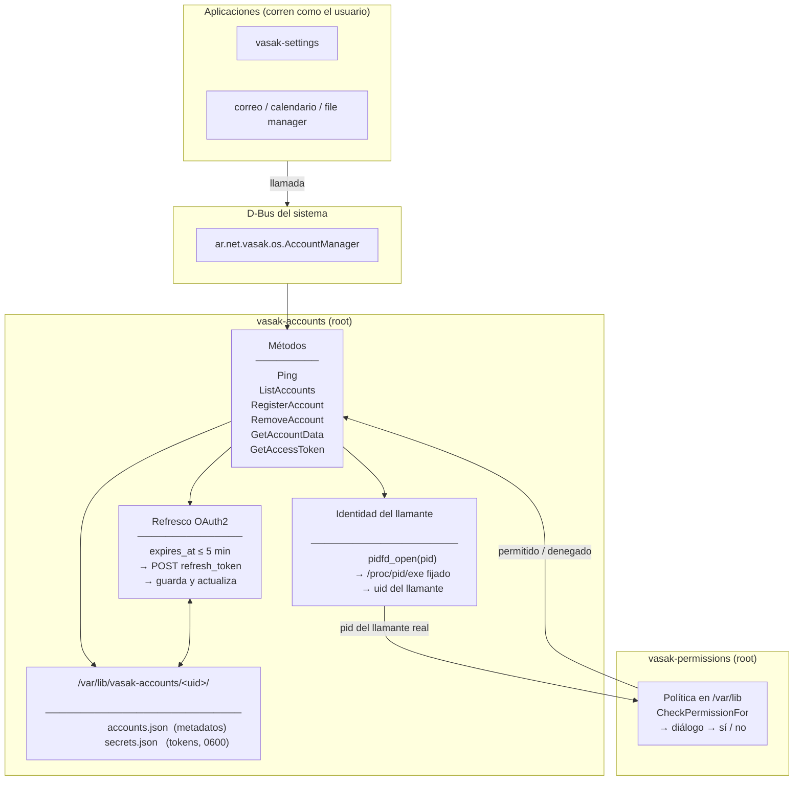
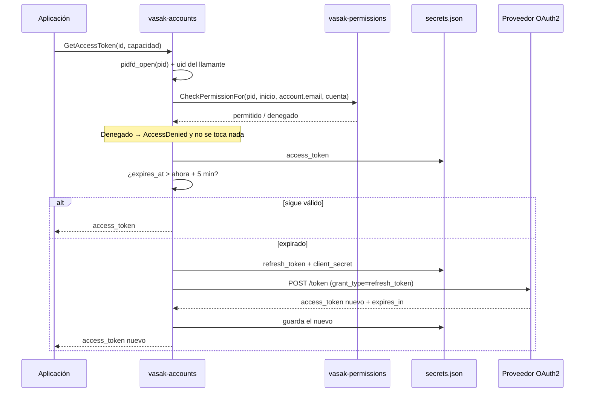

# VasakOS Account Manager

Centro de cuentas de VasakOS. Un servicio **del sistema** que guarda las cuentas
en línea de cada persona, obtiene y refresca sus tokens, y decide —preguntando a
`vasak-permissions`— qué aplicación puede usar cuál.

La idea que lo justifica: **la aplicación nunca ve tu token, se lo pide al
sistema.** Los tokens viven en archivos de root, así que ni la app de correo ni
nada que corra con tu cuenta puede leerlos por su cuenta; tienen que pasar por
acá, y acá se pregunta.

---

## Cómo encaja con el resto

El centro de cuentas es el dueño de las cuentas y de los tokens. Lo que se hace
con ellos vive en otras aplicaciones:

| Pieza | Qué hace |
|---|---|
| **Este servicio** + su pantalla en `vasak-settings` | Alta y baja de cuentas, secretos, OAuth, y **qué apps tienen acceso** |
| **App de calendario** | Ver y crear eventos de las distintas cuentas |
| **App de correo** | Ver el correo y redactar/enviar |
| **File manager** | Discos en la nube |
| **App de chats** | Más adelante |

El plan por escrito, con las fases y lo que cuesta cada proveedor, está en
[`issues/cuentas-en-linea-roadmap.md`](https://github.com/Vasak-OS/VasakOS)
del workspace.

---

## Arquitectura



### Por qué corre como root en el bus del sistema

Porque los tokens están en archivos de root, y eso es a propósito. Antes vivían
en el llavero del usuario, lo que dejaba el control de acceso en la nada:
cualquier programa corriendo con esa cuenta podía pedirle el token al llavero
directamente y saltarse la pregunta. Con los archivos del lado de root, este
servicio es la única puerta.

Y por lo mismo no puede ser un servicio de sesión: uno de sesión lo podría
reemplazar cualquier cosa que llegue primero al nombre del bus, y recibiría las
peticiones —y los tokens— en su lugar.

### Quién decide los permisos

No este servicio. Las reglas están en `vasak-permissions`, que guarda su política
fuera del alcance del usuario y exige polkit para cambiarla. Acá se pregunta con
`CheckPermissionFor`, pasando el **PID del programa que llamó**, no el propio: si
no fuera así, una sola decisión quedaría grabada contra
`/usr/bin/vasak-accounts` y la compartirían todas las aplicaciones.

Los identificadores de recurso son `account.email`, `account.calendar`,
`account.contacts`, `account.chat`, `account.drive` y `account.tasks`. El permiso
es **por aplicación y recurso, no por cuenta**: permitirle el correo a la app de
correo le permite todas tus casillas.

---

## API D-Bus

**Servicio:** `ar.net.vasak.os.AccountManager` (bus del **sistema**)
**Objeto:** `/ar/net/vasak/os/AccountManager`
**Interfaz:** `ar.net.vasak.os.AccountManager`

| Método | Entrada | Salida | Permiso | Descripción |
|---|---|---|---|---|
| `Ping` | — | `s` | — | Identifica al llamante (PID + binario). Diagnóstico. |
| `ListAccounts` | — | `s` (JSON) | — | Las cuentas del usuario que llama. **Sólo metadatos**, nunca un token. |
| `RegisterAccount` | `s` nombre, `s` proveedor, `s` capacidades JSON, `s` secretos JSON | `s` id | — | Agrega una cuenta y guarda sus secretos. Agregar una cuenta *tuya* no necesita autorización: es tuya. Lo que la necesita es que un programa llegue al token. |
| `RemoveAccount` | `s` id | `b` | — | Borra la cuenta **y todos sus secretos**. |
| `GetAccountData` | `s` id, `s` capacidad | `s` (JSON) | ✅ | Configuración de esa capacidad. |
| `GetAccessToken` | `s` id, `s` capacidad | `s` | ✅ | Un access_token **válido**, refrescándolo si hace falta. |

Las capacidades se nombran en minúscula: `email`, `calendar`, `contacts`,
`chat`, `drive`, `tasks`. Cualquier otra cosa devuelve `InvalidArgs` con la
lista de las válidas.

### Probar a mano

```bash
busctl call ar.net.vasak.os.AccountManager \
    /ar/net/vasak/os/AccountManager \
    ar.net.vasak.os.AccountManager Ping
```

```bash
busctl call ar.net.vasak.os.AccountManager \
    /ar/net/vasak/os/AccountManager \
    ar.net.vasak.os.AccountManager ListAccounts
```

```bash
busctl call ar.net.vasak.os.AccountManager \
    /ar/net/vasak/os/AccountManager \
    ar.net.vasak.os.AccountManager GetAccessToken ss "<id>" "email"
```

Sin `--user`: es el bus del sistema.

### Flujo de `GetAccessToken`



---

## Almacenamiento

Todo bajo `/var/lib/vasak-accounts/<uid>/`, un directorio por persona en modo
`0700`:

| Archivo | Modo | Contenido |
|---|---|---|
| `accounts.json` | 0600 | Metadatos: id, nombre, proveedor y la configuración de cada capacidad |
| `secrets.json` | 0600 | `access`, `refresh`, `client_secret` por cuenta |

Los dos se escriben creándolos ya en 0600 y renombrándolos encima del anterior,
así un token nunca queda un instante legible por todo el mundo ni un corte a
mitad de escritura deja medio archivo donde estaban las credenciales.

**No están cifrados, y es una decisión.** Una clave que el servicio pueda leer
solo tiene que estar guardada al lado de lo que protege, y eso no compra nada
frente a quien ya puede leer el archivo — el mismo razonamiento por el que
NetworkManager guarda las claves de Wi-Fi como texto plano de root. De un disco
robado se ocupa el cifrado de disco completo, no este archivo.

```rust
pub enum CapabilityType { Email, Calendar, Contacts, Chat, Drive, Tasks }

pub struct Account {
    pub id: String,
    pub display_name: String,
    pub provider_type: String,
    pub capabilities: HashMap<CapabilityType, Value>,
}
```

---

## Estructura

```
vasak-accounts/
├── Cargo.toml
├── README.md
├── packaging/
│   ├── vasak-accounts.service                    # unidad de sistema, Type=dbus
│   ├── ar.net.vasak.os.AccountManager.service    # activación por D-Bus
│   └── ar.net.vasak.os.AccountManager.conf       # política del bus: sólo root es dueño
└── src/
    ├── main.rs          # los métodos D-Bus
    ├── storage.rs       # cuentas, secretos y capacidades
    ├── auth.rs          # PinnedCaller: identidad fijada con pidfd
    ├── permissions.rs   # la consulta a vasak-permissions
    └── protocols/
        ├── mod.rs
        └── oauth2.rs    # refresco de tokens
```

---

## Compilar y probar

```bash
cargo build --release
```

```bash
cargo test
```

**27 tests** al 9/09/2026, cubriendo el almacén (permisos de archivo, escritura
atómica, aislamiento entre cuentas y entre usuarios, JSON corrupto), el parseo de
capacidades y la lectura de `/proc`.

Para levantarlo sin root durante el desarrollo, una compilación de depuración
acepta `VASAK_ACCOUNTS_TEST_ROOT`, que lo mueve al bus de **sesión** y apunta el
almacén a ese directorio:

```bash
VASAK_ACCOUNTS_TEST_ROOT=/tmp/vasak-accounts-dev RUST_LOG=debug cargo run
```

En release eso no existe: está fuera con `#[cfg(debug_assertions)]`, no detrás de
un `if`. Un servicio que entrega tokens y se puede mover a un bus que el usuario
controla le estaría dando sus peticiones a lo que reclame ese nombre.

`RUST_LOG` acepta `info` (por omisión), `debug` y `trace`.

---

## Requisitos

- Rust 1.75+ (edición 2021)
- D-Bus del sistema
- `vasak-permissions` corriendo — **sin él no se autoriza nada**: el servicio
  rechaza toda petición que necesite permiso
- systemd (la unidad es `Type=dbus`, se activa sola con la primera petición)

---

## Estado

| Etapa | Estado |
|---|---|
| Esqueleto D-Bus con identificación del llamante | ✅ |
| Almacén de metadatos y secretos del lado de root | ✅ |
| Identidad del llamante fijada con `pidfd` (sin TOCTOU) | ✅ |
| Permisos delegados a `vasak-permissions` | ✅ |
| Refresco automático de tokens OAuth2 | ✅ |
| **Flujo de autorización inicial (obtener el primer token)** | ⛔ falta |
| Señales de ciclo de vida | ⛔ falta |
| Reautenticación cuando el proveedor revoca | ⛔ falta |
| Loop de sincronización de correo | ⛔ falta |

Hoy el servicio sabe **refrescar** un token pero no **obtenerlo**:
`RegisterAccount` espera secretos que consiguió alguien más. Conectar una cuenta
OAuth de punta a punta es el próximo trabajo, y el plan está en el roadmap
citado arriba.
