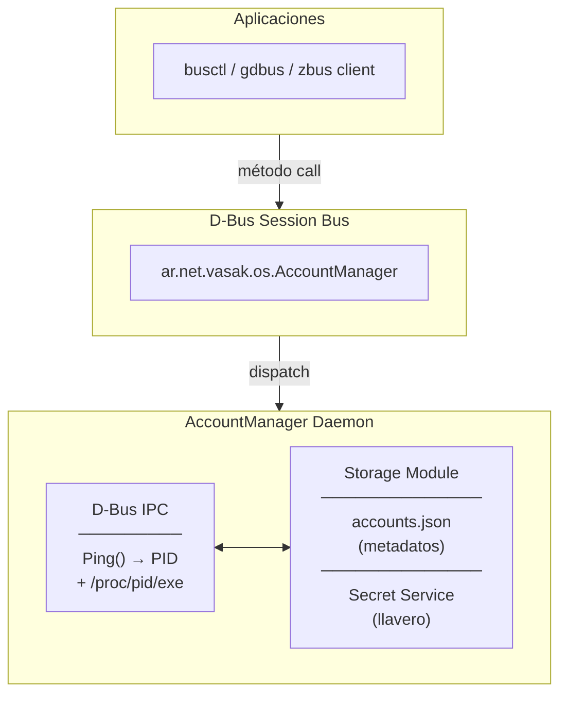

# VasakOS Account Manager

Demonio centralizado en segundo plano para la gestión de cuentas de usuario
en VasakOS. Proporciona un servicio D-Bus que abstrae la autenticación,
almacenamiento de metadatos y manejo seguro de tokens para múltiples
aplicaciones independientes (email, calendarios, contactos, chats, etc.).

---

## Arquitectura



---

## Dependencias (Cargo.toml)

| Crate | Versión | Propósito |
|-------|---------|-----------|
| `zbus` | 4 (tokio) | Comunicación D-Bus |
| `tokio` | 1 (full) | Runtime asíncrono |
| `tracing` / `tracing-subscriber` | 0.1 / 0.3 | Logging estructurado |
| `serde` / `serde_json` | 1 / 1 | Serialización JSON |
| `keyring` | 4 | Llavero del sistema (Secret Service) |
| `uuid` | 1 (v4) | Generación de UUID para cuentas |
| `dirs` | 5 | Resolución de directorios del usuario |

---

## Requisitos del sistema

- **Rust**: 1.75+ (edición 2021)
- **D-Bus**: Sesión de usuario activa (`dbus-daemon --session`)
- **Secret Service**: GNOME Keyring, KDE Wallet o `keepassxc` corriendo
- **systemd** (opcional): para `busctl`

---

## Uso

### Levantar el demonio

```bash
RUST_LOG=info cargo run
```

Variables de entorno disponibles:

| Variable | Valores | Efecto |
|----------|---------|--------|
| `RUST_LOG` | `info`, `debug`, `trace` | Nivel de verbose |

En el primer arranque el servicio crea una cuenta demo para
verificar el funcionamiento del almacenamiento.

### Probar desde otra terminal

```bash
busctl --user call                                     \
    ar.net.vasak.os.AccountManager                    \
    /ar/net/vasak/os/AccountManager                   \
    ar.net.vasak.os.AccountManager                    \
    Ping
```

Alternativa con `gdbus`:

```bash
gdbus call --session                                  \
    --dest ar.net.vasak.os.AccountManager              \
    --object-path /ar/net/vasak/os/AccountManager      \
    --method ar.net.vasak.os.AccountManager.Ping
```

**Importante**: usar `--user` (busctl) o `--session` (gdbus) para
conectarse al bus de sesión. Sin esa bandera, las herramientas
se conectan al bus de sistema por defecto.

### Script automatizado

```bash
./test_ping.sh
```

---

## API D-Bus

### Interfaz

```
ar.net.vasak.os.AccountManager
```

### Objeto

```
/ar/net/vasak/os/AccountManager
```

### Métodos

| Método | Entrada | Salida | Descripción |
|--------|---------|--------|-------------|
| `Ping` | — | `String` | Identifica al cliente (PID + binario) y retorna confirmación |

**Flujo interno de `Ping`:**
1. zbus inyecta la cabecera del mensaje D-Bus via `#[zbus(header)]`
2. Se extrae el `sender` (nombre único, ej. `:1.42`)
3. Se consulta al bus daemon: `GetConnectionUnixProcessID(sender)` → PID
4. Se lee `/proc/{pid}/exe` → ruta absoluta del binario
5. Se registra en logs: `Petición recibida del PID: X (Ruta: /path)`
6. Se retorna el mensaje de confirmación

---

## Módulo `storage`

### `AccountMetadata`

```rust
pub struct AccountMetadata {
    pub id: String,       // UUID v4
    pub provider: String, // "google", "nextcloud", etc.
    pub username: String, // "user@gmail.com"
    pub enabled: bool,
}
```

Persistido en `~/.config/vasakos/accounts.json` como un array JSON.

### `Storage`

```rust
let storage = Storage::new()?;

// Metadatos
let accounts = storage.load_accounts()?;
storage.save_accounts(&accounts)?;
storage.add_account(&new_account)?;

// Secretos (llavero del sistema)
storage.store_secret(&account_id, "token")?;
let token = storage.get_secret(&account_id)?;
storage.delete_secret(&account_id)?;
```

Los secretos se almacenan en el **Secret Service** de Linux (GNOME
Keyring / KDE Wallet) bajo el servicio `vasakos-account-manager`,
indexados por `account_id`.

### `StorageError`

Enum con tres variantes que implementa `std::error::Error`:

- `StorageError::Io(std::io::Error)`
- `StorageError::Json(serde_json::Error)`
- `StorageError::Keyring(keyring::Error)`

Cada una incluye conversión `From` automática.

---

## Estructura del proyecto

```
vasak-accounts/
├── Cargo.toml
├── .gitignore
├── README.md
├── test_ping.sh
└── src/
    ├── main.rs          # Servicio D-Bus + demo de storage
    └── storage.rs       # Módulo de almacenamiento (JSON + llavero)
```

---

## Tests

```bash
cargo test
```

Actualmente hay 2 tests unitarios en `storage`:

- `test_account_metadata_roundtrip` — serialización/deserialización
- `test_json_file_roundtrip` — escritura/lectura del archivo JSON

---

## Etapas del proyecto

| Etapa | Estado | Descripción |
|-------|--------|-------------|
| 1 | ✓ | Esqueleto D-Bus con `Ping` e identificación de cliente |
| 2 | ✓ | Módulo `storage`: metadatos JSON + llavero Secret Service |
| 3 | — | Métodos D-Bus para CRUD de cuentas |
| 4 | — | Sincronización con proveedores remotos |
| 5 | — | Notificaciones vía señales D-Bus |
