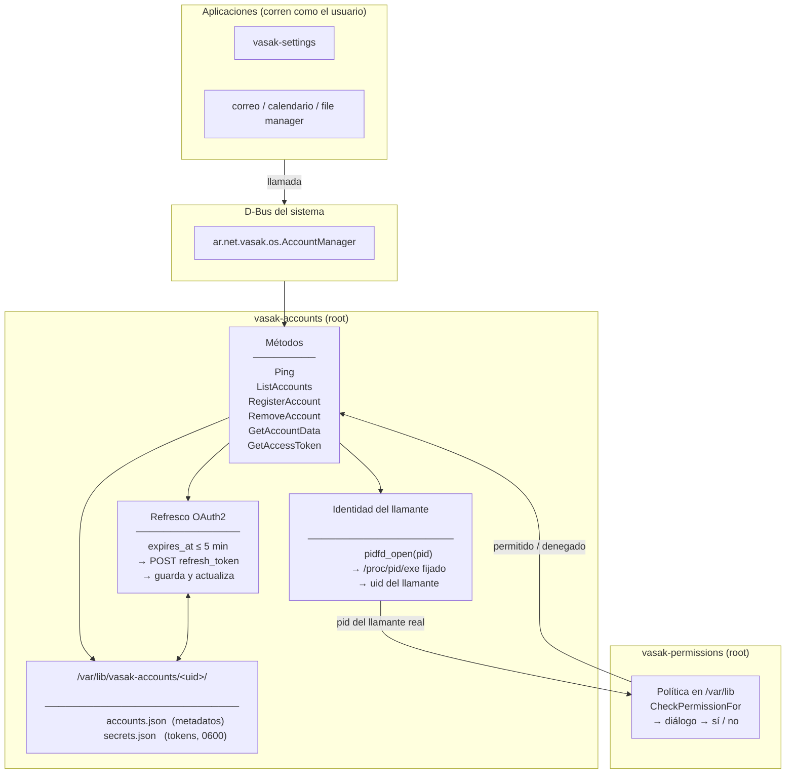
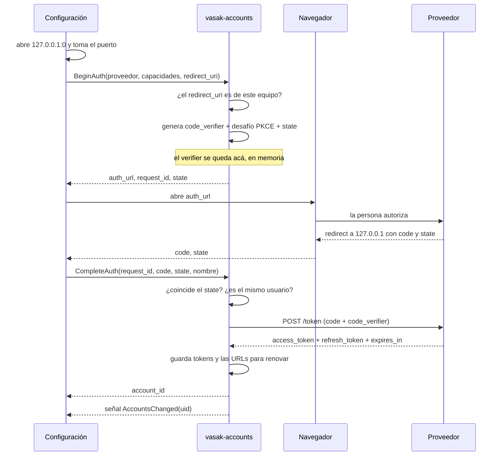
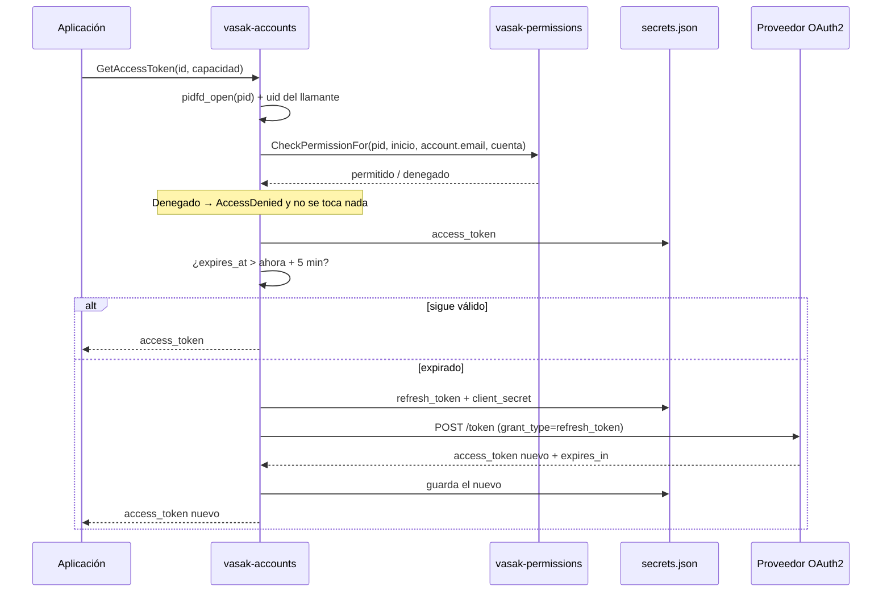
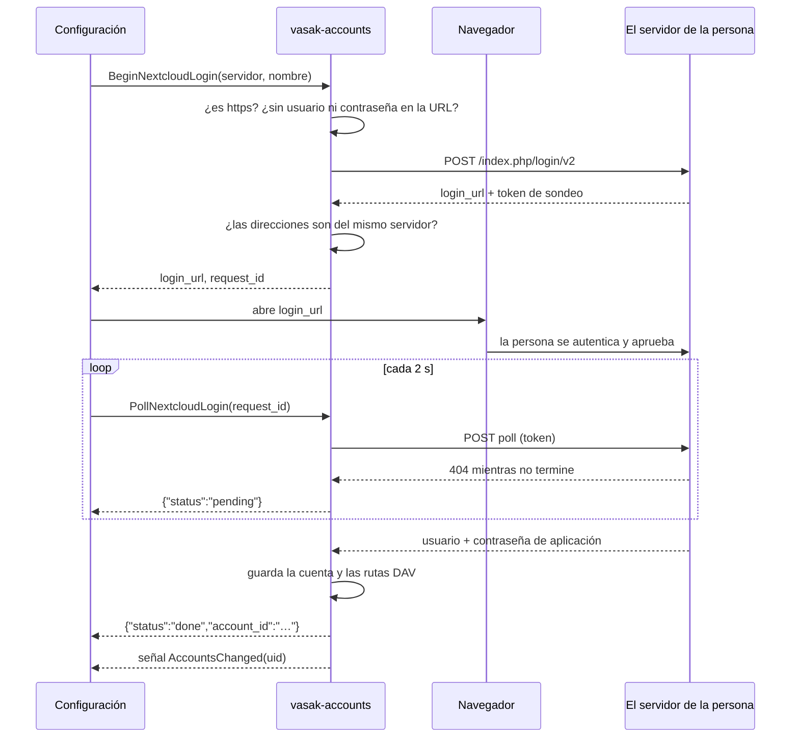

# VasakOS Account Manager

Centro de cuentas de VasakOS. Un servicio **del sistema** que guarda las cuentas
en línea de cada persona, obtiene y refresca sus tokens, y decide —preguntando a
`vasak-permissions`— qué aplicación puede usar cuál.

La idea que lo justifica: **una aplicación no puede leer tus tokens, tiene que
pedirlos — y entonces se te pregunta.** Los archivos son de root, así que ni la
app de correo ni nada que corra con tu cuenta los abre por su cuenta. Si la
autorizás, `GetAccessToken` le entrega el token de la capacidad que pidió y de
ninguna otra; si no, no le entrega nada. El permiso es lo que separa pedirlo de
tenerlo.

---

## Cómo encaja con el resto

El centro de cuentas es el dueño de las cuentas y de los tokens. Lo que se hace
con ellos vive en otras aplicaciones:

| Pieza | Qué hace |
|---|---|
| **`vasak-accounts`** (root) + su pantalla en `vasak-settings` | Alta y baja de cuentas, secretos, OAuth, y **qué apps tienen acceso** |
| **`vasak-accounts-sync`** (el usuario) | Mantiene al día el correo. Ver abajo. |
| **App de calendario** | Ver y crear eventos de las distintas cuentas |
| **App de correo** | Ver el correo y redactar/enviar |
| **File manager** | Discos en la nube |
| **App de chats** | Más adelante |

El plan por escrito, con las fases y lo que cuesta cada proveedor, está en
`issues/cuentas-en-linea-roadmap.md`, en el workspace de VasakOS — que no es un
repositorio, así que no hay enlace que poner.

---

## Arquitectura



### Por qué corre como root en el bus del sistema

Porque los tokens están en archivos de root, y eso es a propósito. Antes vivían
en el llavero del usuario, lo que dejaba el control de acceso en la nada:
cualquier programa corriendo con esa cuenta podía pedirle el token al llavero
directamente y saltarse la pregunta. Con los archivos del lado de root, este
servicio es la única puerta.

Y por lo mismo no puede ser un servicio de sesión: uno de sesión lo podría
reemplazar cualquier cosa que llegue primero al nombre del bus, y recibiría las
peticiones —y los tokens— en su lugar.

### Quién decide los permisos

No este servicio. Las reglas están en `vasak-permissions`, que guarda su política
fuera del alcance del usuario y exige polkit para cambiarla. Acá se pregunta con
`CheckPermissionFor`, pasando el **PID del programa que llamó**, no el propio: si
no fuera así, una sola decisión quedaría grabada contra
`/usr/bin/vasak-accounts` y la compartirían todas las aplicaciones.

Los identificadores de recurso son `account.email`, `account.calendar`,
`account.contacts`, `account.chat`, `account.drive` y `account.tasks`. El permiso
es **por aplicación y recurso, no por cuenta**: permitirle el correo a la app de
correo le permite todas tus casillas.

---

## API D-Bus

**Servicio:** `ar.net.vasak.os.AccountManager` (bus del **sistema**)
**Objeto:** `/ar/net/vasak/os/AccountManager`
**Interfaz:** `ar.net.vasak.os.AccountManager`

| Método | Entrada | Salida | Permiso | Descripción |
|---|---|---|---|---|
| `Ping` | — | `s` | — | Identifica al llamante (PID + binario). Diagnóstico. |
| `ListAccounts` | — | `s` (JSON) | — | Resumen de las cuentas del usuario que llama. Nunca un token. |
| `ListProviders` | — | `s` (JSON) | — | Qué proveedores hay y cuáles están configurados. |
| `BeginAuth` | `s` proveedor, `s` capacidades JSON, `s` redirect_uri | `s` (JSON) | — | Empieza a conectar una cuenta OAuth2. Devuelve `auth_url`, `request_id` y `state`. |
| `CompleteAuth` | `s` request_id, `s` code, `s` state, `s` nombre | `s` id | — | Canjea el código y crea la cuenta. |
| `CancelAuth` | `s` request_id | `b` | — | Descarta un flujo abandonado. |
| `SetProviderCredentials` | `s` proveedor, `s` client_id, `s` client_secret | — | — | Guarda **tus** credenciales para un proveedor OAuth2. |
| `ClearProviderCredentials` | `s` proveedor | — | — | Las quita. Las cuentas ya conectadas siguen andando. |
| `BeginNextcloudLogin` | `s` servidor, `s` nombre | `s` (JSON) | — | Abre un inicio de sesión en un Nextcloud. Devuelve `login_url` y `request_id`. |
| `PollNextcloudLogin` | `s` request_id | `s` (JSON) | — | Un sondeo: `pending`, o `done` con el `account_id`. |
| `RegisterAccount` | `s` nombre, `s` proveedor, `s` capacidades JSON, `s` secretos JSON | `s` id | — | Cuenta con credenciales de **contraseña** (IMAP y compañía). No acepta secretos de OAuth2. |
| `RemoveAccount` | `s` id | `s` (JSON) | — | Borra la cuenta, sus secretos, **y le avisa al proveedor**. Devuelve `{removed, revoked, detail}`. |
| `GetAccountData` | `s` id, `s` capacidad | `s` (JSON) | ✅ | Configuración de esa capacidad. |
| `GetAccessToken` | `s` id, `s` capacidad | `s` | ✅ | Un access_token **válido**, refrescándolo si hace falta. |

### Señal

| Señal | Cuerpo | Cuándo |
|---|---|---|
| `AccountsChanged` | `u` uid | Cambió algo de ese usuario: una cuenta, o las credenciales de un proveedor |

Una sola señal y sin detalle, a propósito. Este servicio atiende a todo el
equipo desde el bus del sistema, así que la señal la reciben todas las sesiones:
con el identificador de la cuenta adentro, quien escuche se enteraría de que a
la persona de al lado le cambió tal cuenta. Un `uid` no dice nada que no se vea
con `who`.

Y funciona mejor: quien la recibe vuelve a leer y ve el estado completo. Con
señales que llevan el cambio adentro, una que se pierde deja al cliente creyendo
algo que no es.

**Hay que releer `ListAccounts` y `ListProviders`.** Las dos cosas cambian por
esta señal: agregar o quitar una cuenta mueve la primera, y poner o sacar
credenciales propias mueve el `configured` de la segunda. Releer sólo una deja
la pantalla mostrando un proveedor apagado que ya está listo, o al revés.

### Por qué `ListAccounts` no pide permiso

Porque preguntar por algo tan seguido es lo que enseña a apretar «permitir» sin
leer, y ahí se pierde el valor de preguntar cuando importa: abrir la pantalla de
cuentas, o que la app de calendario dibuje una lista, no puede costar un diálogo
por cuenta.

Lo que se paga es que la lista la ve cualquier programa del usuario. Por eso sale
un **resumen** —id, nombre, proveedor, qué capacidades tiene y si hay que
reconectarla— y no la cuenta entera. La configuración completa, con el servidor
y el `client_id`, sigue detrás de `GetAccountData`, que sí pregunta.

Las capacidades se nombran en minúscula: `email`, `calendar`, `contacts`,
`chat`, `drive`, `tasks`. Cualquier otra cosa devuelve `InvalidArgs` con la
lista de las válidas.

### Probar a mano

```bash
busctl call ar.net.vasak.os.AccountManager \
    /ar/net/vasak/os/AccountManager \
    ar.net.vasak.os.AccountManager Ping
```

```bash
busctl call ar.net.vasak.os.AccountManager \
    /ar/net/vasak/os/AccountManager \
    ar.net.vasak.os.AccountManager ListAccounts
```

```bash
busctl call ar.net.vasak.os.AccountManager \
    /ar/net/vasak/os/AccountManager \
    ar.net.vasak.os.AccountManager GetAccessToken ss "<id>" "email"
```

Sin `--user`: es el bus del sistema.

### Flujo de conexión de una cuenta



Lo que hace que esto valga la pena: el `code_verifier` se genera en el servicio
y no sale de ahí. Un código de autorización sin su verifier no sirve para nada,
así que lo que la ventana de configuración maneja **no es un secreto**. Antes el
canje ocurría en el webview, y el `refresh_token` terminaba pasando por un
proceso del usuario — justo lo que se había evitado al mover los tokens a
archivos de root.

### Flujo de `GetAccessToken`



---

## Borrar una cuenta le avisa al proveedor

Sin ese aviso, borrar una cuenta borraba lo de acá y del otro lado quedaba todo
vivo: la autorización seguía figurando entre las aplicaciones con acceso y el
token servía hasta caducar. Quien borra una cuenta espera que se corte el acceso,
no que se esconda.

Cada proveedor lo hace distinto:

| | Cómo |
|---|---|
| OAuth2 con `revocation_url` | `POST` al endpoint de RFC 7009 con el **refresh_token** |
| Nextcloud | `DELETE` a `ocs/v2.php/core/apppassword`, autenticado con la propia contraseña de aplicación |
| IMAP con contraseña | Nada que revocar: la contraseña es de la persona |

Se manda el refresh_token y no el de acceso: revocar el refresh invalida la
concesión entera, mientras que revocar uno de acceso deja al otro vivo y la
aplicación seguiría figurando entre las que tienen permiso.

**Si el aviso falla, la cuenta se borra igual.** Negarse dejaría a alguien sin
poder sacar una cuenta porque no tiene red, o porque el servidor de su casa está
apagado, y eso es peor que el problema. Lo que sí se hace es decirlo —`revoked`
viene en `false` con el motivo— porque queda algo que se puede terminar desde la
web del proveedor. Microsoft es el caso permanente de eso: no expone endpoint de
revocación, así que el acceso se quita desde la página de la cuenta.

La dirección para avisar se guarda **con la cuenta** y no se busca en el catálogo
al borrarla: si mañana cambia el archivo de `/etc`, hay que avisarle al servidor
al que esa cuenta autorizó y no al que diga el archivo nuevo.

## Almacenamiento

Todo bajo `/var/lib/vasak-accounts/<uid>/`, un directorio por persona en modo
`0700`:

| Archivo | Modo | Contenido |
|---|---|---|
| `accounts.json` | 0600 | Metadatos: id, nombre, proveedor y la configuración de cada capacidad |
| `secrets.json` | 0600 | `access`, `refresh`, `client_secret` por cuenta |

Los dos se escriben creándolos ya en 0600 y renombrándolos encima del anterior,
así un token nunca queda un instante legible por todo el mundo ni un corte a
mitad de escritura deja medio archivo donde estaban las credenciales.

**No están cifrados, y es una decisión.** Una clave que el servicio pueda leer
solo tiene que estar guardada al lado de lo que protege, y eso no compra nada
frente a quien ya puede leer el archivo — el mismo razonamiento por el que
NetworkManager guarda las claves de Wi-Fi como texto plano de root. De un disco
robado se ocupa el cifrado de disco completo, no este archivo.

```rust
pub enum CapabilityType { Email, Calendar, Contacts, Chat, Drive, Tasks }

pub struct Account {
    pub id: String,
    pub display_name: String,
    pub provider_type: String,
    pub capabilities: HashMap<CapabilityType, Value>,
}
```

---

## Estructura

```text
vasak-accounts/
├── Cargo.toml            # el workspace
├── README.md
├── daemon/               # el servicio de root
│   ├── packaging/
│   │   ├── vasak-accounts.service                 # unidad de sistema, Type=dbus
│   │   ├── ar.net.vasak.os.AccountManager.service # activación por D-Bus
│   │   ├── ar.net.vasak.os.AccountManager.conf    # política: sólo root es dueño
│   │   └── providers.d/                           # catálogo, sin client_id
│   └── src/
│       ├── main.rs          # los métodos D-Bus
│       ├── storage.rs       # cuentas, secretos y capacidades
│       ├── auth.rs          # PinnedCaller: identidad fijada con pidfd
│       ├── permissions.rs   # la consulta a vasak-permissions
│       ├── providers.rs     # el catálogo y las credenciales propias
│       ├── pending.rs       # flujos a medio terminar (sólo en memoria)
│       └── protocols/
│           ├── nextcloud.rs # Login Flow v2: sin registrar nada con nadie
│           └── oauth2.rs    # armado de la URL, canje y refresco
└── sync/                 # el servicio del usuario
    ├── packaging/
    │   ├── vasak-accounts-sync.service            # unidad de **usuario**
    │   └── ar.net.vasak.os.AccountsSync.service   # activación por D-Bus
    └── src/
        ├── main.rs          # el bucle y la interfaz de sesión
        ├── broker.rs        # le pide al servicio, como cualquier aplicación
        └── imap.rs          # lo justo para contar el correo sin leer
```

---

## Compilar y probar

```bash
cargo build --release
```

```bash
cargo test
```

**86 tests** al 9/09/2026, cubriendo el almacén (permisos de archivo, escritura
atómica, aislamiento entre cuentas y entre usuarios, JSON corrupto), el parseo de
capacidades, la lectura de `/proc`, el catálogo de proveedores —incluidos los
archivos que el paquete instala—, el armado de la URL de autorización, los
flujos a medio terminar (vencimiento, `state` que no coincide, tope por usuario,
tipo equivocado) y el Login Flow v2 de Nextcloud (validación de la dirección,
procedencia del sondeo, armado de las rutas DAV).

Para levantarlo sin root durante el desarrollo, una compilación de depuración
acepta `VASAK_ACCOUNTS_TEST_ROOT`, que lo mueve al bus de **sesión** y apunta el
almacén a ese directorio:

```bash
VASAK_ACCOUNTS_TEST_ROOT=/tmp/vasak-accounts-dev RUST_LOG=debug cargo run
```

En release eso no existe: está fuera con `#[cfg(debug_assertions)]`, no detrás de
un `if`. Un servicio que entrega tokens y se puede mover a un bus que el usuario
controla le estaría dando sus peticiones a lo que reclame ese nombre.

`RUST_LOG` acepta `info` (por omisión), `debug` y `trace`.

---

## Los dos binarios

El repositorio tiene dos, y hacen cosas deliberadamente distintas.

| | Corre como | Bus | Qué toca |
|---|---|---|---|
| `vasak-accounts` | **root** | sistema | Cuentas, tokens, permisos. De la red, sólo el JSON de un endpoint de OAuth2. |
| `vasak-accounts-sync` | **la persona** | sesión | Habla IMAP con los servidores de correo de la persona. |

La separación es el punto. Hablar IMAP es leer lo que manda un servidor
cualquiera, y eso no puede pasar por un proceso de root: si un parser falla, lo
que se compromete son los permisos más altos del sistema. Es el mismo criterio
por el que la prueba de conexión y el autodescubrimiento viven en la ventana de
configuración.

**El sync no tiene ningún atajo por estar en el mismo repositorio.** Le pide los
tokens al servicio por el mismo método D-Bus que usaría una aplicación de
terceros, y la primera vez la persona ve el mismo diálogo de permiso. Eso es
media razón de que se haya escrito antes que la aplicación de correo: es el
primer cliente real del modelo de permisos, así que lo ejercita de punta a punta
antes de que dependa de él algo que la gente usa.

### Qué hace el sync hoy, y qué no

Cuenta el correo sin leer de cada cuenta y lo publica en
`ar.net.vasak.os.AccountsSync` (bus de sesión), con una señal `MailboxChanged`
cuando cambia.

**No guarda mensajes**, y no es una etapa a medio hacer: un caché sería
inventarle un formato a una aplicación de correo que todavía no existe, y el día
que exista va a querer otro. Contar sin leer sirve hoy —el escritorio puede
mostrar que llegó algo— y se apoya en `STATUS`, que devuelve cuatro números: ni
una línea de parser sobre lo que escribió un remitente desconocido. Ese parser
va a llegar, y va a merecer su propia discusión.

**Espera a que el servidor avise** (IMAP IDLE), así el correo nuevo aparece en el
momento en vez de hasta cinco minutos después. Hay una conexión viva por cuenta,
en su propia tarea; contra un servidor que no sabe avisar se vuelve a mirar cada
cinco minutos sobre esa misma conexión, que igual es mejor que reconectarse cada
vez.

Todo intercambio con el servidor tiene tope. Un servidor que deja de escribir
**sin cerrar el socket** —un NAT que olvidó la conexión, un proceso matado sin
FIN— no produce ningún error: la lectura no vuelve nunca. En una conexión que
dura horas eso pasa, y sin tope la cuenta quedaría muda hasta reiniciar el
proceso. La única espera larga es la de IDLE, que tiene la suya.

La espera se renueva cada veinticuatro minutos —el estándar pide hacerlo antes de
los veintinueve, o el servidor y cualquier NAT en el medio cortan por
inactividad—. Esa renovación es además el pulso que mantiene los tokens frescos:
en cada una se le vuelve a pedir el token al servicio, que es lo que hace que lo
refresque. Sin eso, una cuenta que anda podría quedarse con un `refresh_token`
caducado por no usarse.

Una cuenta cuyo servidor rechaza las credenciales **deja de mirarse** hasta que
algo cambie: su tarea termina, queda anotada, y no vuelve a arrancar hasta que el
servicio avise que las cuentas cambiaron — que es cuando la persona pudo haber
corregido la contraseña. La anotación hace falta: sin ella la revisión periódica
la levantaría de nuevo cada cinco minutos. Insistir con una credencial rechazada es cómo se bloquea una
cuenta. Una conexión cortada, en cambio, se reconecta a los treinta segundos: que
se caiga el wifi o se reinicie el servidor es lo normal en una conexión que dura
horas, no un error.

## Nextcloud: el único que no hay que configurar

Nextcloud no usa OAuth2 sino su **Login Flow v2**, y la diferencia es la que
importa de todo este documento: **no hay nada que registrar**. La persona
escribe la dirección de su servidor, ese servidor la autentica en su propia
pantalla y le entrega una contraseña de aplicación. VasakOS no interviene, no
pide permiso a nadie y no paga nada.



Tres cosas que este flujo hace y conviene saber por qué:

- **Se exige HTTPS**, incluso en la red de casa. El servidor está por entregar
  una contraseña que **no caduca**: por HTTP viajaría en claro. Un Nextcloud
  casero sin certificado no es raro, pero conectarlo así sería regalar la
  credencial.
- **Se comprueba que las direcciones que devuelve el servidor sean suyas** —
  esquema, host y puerto. El servidor dice adónde sondear, así que si pudiera
  nombrar otro host le estaría entregando a un tercero el token de sondeo, y con
  él las credenciales en cuanto la persona apruebe.
- **El sondeo es una llamada por vez, no un bucle dentro del servicio.** Un
  método D-Bus que se queda esperando minutos supera el tiempo de espera del bus
  y el cliente recibe un error de transporte en lugar de una respuesta. El bucle
  lo hace el cliente; la contraseña no pasa por él en ningún momento.

Lo que se guarda es una contraseña de aplicación, no un token: no hay nada que
refrescar, y se revoca desde «Dispositivos y sesiones» del propio servidor, donde
aparece como «VasakOS». Al conectar se guarda además la **ruta DAV de cada
capacidad ya armada**, así que el gestor de archivos, el calendario y los
contactos no tienen que saber cómo se construye una ruta de Nextcloud.

## Proveedores

Las URLs y el `client_id` de cada proveedor viven en archivos, no en el código:

| Dónde | Qué hay | Quién escribe |
|---|---|---|
| `/usr/share/vasak-accounts/providers.d/` | Lo que trae el paquete. **Sin `client_id`.** | el paquete |
| `/etc/vasak-accounts/providers.d/` | Lo que agrega quien administra el equipo. | root |
| `/var/lib/vasak-accounts/<uid>/providers.json` | Las credenciales de esa persona. Le ganan a las dos anteriores. | el servicio, por `SetProviderCredentials` |

**El tercer nivel sólo puede poner el `client_id` y el secreto.** Nunca las URLs
ni los alcances: eso decide a qué servidor se le manda un código de
autorización, y sale únicamente de los archivos de root. Con ese límite, lo peor
que se puede hacer desde la pantalla es poner un identificador equivocado y que
el flujo falle. El tipo que se guarda no tiene campos para una URL, así que el
límite lo sostiene el compilador y no una comprobación que alguien pueda
olvidarse de hacer.

Y es **por persona**, no del equipo, porque eso es lo que es: una credencial que
cada quien saca con su propia cuenta en la consola del proveedor. Por eso
tampoco pide la contraseña de administrador — sólo afecta a quien la pone.

Cada archivo declara su `kind`: `oauth2` (por omisión) o `nextcloud`. Un
proveedor de Nextcloud no lleva URLs ni `client_id` —la dirección la escribe la
persona— y por eso está listo desde que se instala.

Los dos son de root. Un proveedor define a qué servidor se le mandan los códigos
de autorización, así que si el usuario pudiera escribirlos, un programa corriendo
con su cuenta podría apuntar «Google» a otro lado.

**VasakOS no distribuye un `client_id` propio, y no es un olvido.** Registrar la
aplicación con Google para llegar al correo exige una evaluación de seguridad
hecha por un tercero, que se paga y se repite cada año. En vez de prometer algo
que la distribución no puede sostener, los archivos vienen listos para que quien
quiera use el suyo — que es gratis y se saca en diez minutos. Cada archivo
explica cómo adentro, y el error que devuelve el servicio dice dónde dejarlo.

Para el correo de Gmail el camino recomendado **no** es OAuth: es agregar la
casilla como servidor personalizado por IMAP con una contraseña de aplicación.
No caduca, no depende de ningún registro y no cuesta nada.

## Requisitos

- Rust 1.75+ (edición 2021)
- D-Bus del sistema
- `vasak-permissions` corriendo — **sin él no se autoriza nada**: el servicio
  rechaza toda petición que necesite permiso
- systemd (la unidad es `Type=dbus`, se activa sola con la primera petición)

---

## Estado

| Etapa | Estado |
|---|---|
| Esqueleto D-Bus con identificación del llamante | ✅ |
| Almacén de metadatos y secretos del lado de root | ✅ |
| Identidad del llamante fijada con `pidfd` (sin TOCTOU) | ✅ |
| Permisos delegados a `vasak-permissions` | ✅ |
| Refresco automático de tokens OAuth2 | ✅ |
| Flujo de autorización inicial con PKCE del lado del servicio | ✅ |
| Catálogo de proveedores en archivos, sin recompilar | ✅ |
| Señal de ciclo de vida | ✅ |
| Marca de «necesita reautenticación» al revocarse | ✅ |
| Nextcloud Login Flow v2 | ✅ |
| Prueba de conexión al registrar IMAP/SMTP | ⛔ falta |
| CalDAV/CardDAV con autodescubrimiento | ⛔ falta |
| Contador de correo sin leer (`vasak-accounts-sync`) | ✅ |
| IMAP IDLE, para que avise en vez de preguntar | ✅ |
| Caché de mensajes para la aplicación de correo | ⛔ falta (y a propósito: no existe la app) |

Con Nextcloud adentro, el modelo de cuentas funciona de punta a punta **sin
depender de nadie**: es el único proveedor donde eso es posible hoy. Lo que
sigue es la prueba de conexión al registrar IMAP/SMTP, el autodescubrimiento de
CalDAV/CardDAV, y después el bucle de sincronización — que va en un binario
aparte y como servicio **del usuario**, porque parsear correo ajeno no puede
pasar por root. El plan está en el roadmap citado arriba.
